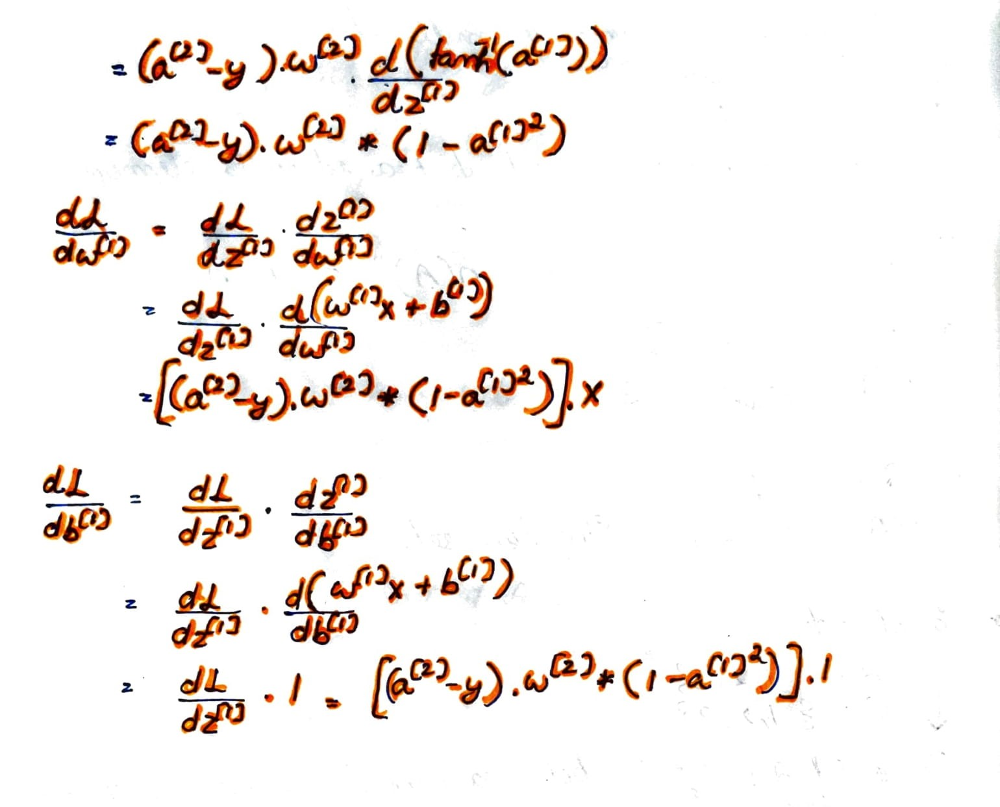

# AI
AI refers to the effort to automate intellectual tasks normally performed by humans, it makes use of set of rules and algorithms to figure out outcome based on those rules. Initally rules were hardwired manually using common logic, but this method of manually specifying the rules is time consuming and unscalable for various fields, thus to automate this process emerged the field of machine learning, and deep learning is just a form of machine learning wherein we use **neural networks** inspired on the structure and functioning of neurons in human body, data is represented in layers, "extracted through a multistage information extraction process".

Using the `Data and Answer we can derive the rules using machine learning techniques`, rather than the user giving the data and the rules to obtain the answer (which is classical programming techniques).  

The simplest form of a neural network is logistic regression for classification of objects.  

# Logistic Regression
Given,   
  
  

  
If what we wish to predict is the probability of a class  given some features , which can be represented as:  
  

Then we can have:  
  
Where, 
and,  
  
  
### Cost function 
The **Loss function** is given by <br>   

**Intuition behind the loss function:**  
* For y = 1, we want  to be as large as possible
* For y = 0, we want  to be as large as possible   

Because in both cases since terms are enclosed in `-ve`, if the term is large enough,  is minimized.  

**Cost Function** <br>   
For `m` training samples.  

The goal is to find the values of `w` and `b` that minimizes the cost function , which can be accomplished using gradient descent.  

For the given cost function,, which is a convex function, we can initialize the variables w and b, both to 0, and repeat the following steps which is a series of updation that finds the slope of the point on the function and adjusts the given parameters using this slope  with learning rate  for the parameter `w` and similarly  for the parameter `b` till we reach the optimum minima.

**Algorithm**:  
```python
  while(True):
    w = w + learning_rate * slope_dJ_by_dw # Slope of cost function w.r.t w
    b = b + learning_rate * slope_dJ_by_db # Slope of cost function w.r.t b
```

**Intuition behind working of gradient descent**:   
Taking derivative of the cost function at a point (w,b) gives the surface(function) w.r.t these points, and the value of w and b are adjusted taking the derivative of J w.r.t w and b respectively.   
When we take derivative of a function say,  we get  which tells us that for any value of a, if it were to be incremeneted by a very small value of the order of  then the value of the resultant of the function increases by approximately  times. We apply this principle in figuring out the optimum minima for any given function by progressively decrementing/incrementing the values the parameters till we get `slope == 0`, which for a convex function is the optimum minima.  

Simple program for logistic regression:  
```python
m = 1000
J_array, b = np.zeros((m,1)), 0

np.random.seed(197)

w = np.zeros((1,2))
x_1 = np.random.randint(10, size = m).reshape(-1,m)
x_2 = np.random.randint(low = 25, high = 50, size = m).reshape(-1,m)
x = np.array([x_1,x_2]).reshape(2,m)

y = np.where(((x[1]<37.5) & (x[0]>5)), 1, 0)

for i in range(1000):
    z = np.zeros(m)
    a = np.zeros(m)

    z = np.dot(w,x) + b
    a = sigma(z)
    J = (-(y * np.log(a) + (1-y)* np.log(1-a))).mean()
    dz = a - y
    dw = (np.dot(x,dz.T).reshape(-1,2))/m
    db = dz.mean()
    w = w - alpha * dw
    b = b - alpha * db
    J_array[i] = J 

print(J_array[m-1])
```
o/p - [0.16131403]  

# Neural Network
Each layer comprises of one or more nodes and the `parameters` of node are represented with layer identity enclosed within `square brackets []`.   

At each layer of the neural network, that comprises of stack of nodes, comprise of both their own individual `z`,  calculation as well as for `a`,   
The final output of the neural network is given by  provided l is the final output layer of the network.  

Basics:
*  represent the '*activations*' to the input layer of the neural network.  
* The parameters associated with each layer are  and  which are vectors of dimension k x j, were k is the number of nodes in that layer and j is the number of activation inputs, and column vector of dimension k x 1 respectively.  
* A two layer neural network comprises of the input layer (layer 0), hidden layer and output layer.  
* For input x, the parameters of the hidden layer and output layer can be represented in vectorized notation as:
    *   
    *   
    *   
    * ,  
        
        Where,  
            , a 43 matrix for 3 inputs (layer 0) and 4 nodes stacked in the hidden layer (layer 1),  
            and   
      
       
    Here, 
    <div display="block" overflow="auto">
      <table position="absolute" align="left">  
          <thead>
            <tr>
              <td>Parameter - Matrix</td>
              <td>Dimension</td>
            </tr>
          </thead>
          <tbody>
            <tr>
              <td></td>
              <td>3 X 1</td>
            </tr>
            <tr>
              <td></td>
              <td>4 X 3</td>
            </tr>
            <tr>
              <td></td>
              <td>4 X 1</td>
            </tr>
            <tr>
              <td></td>
              <td>4 X 1</td>
            </tr>
            <tr>
              <td></td>
              <td>1 X 4</td>
            </tr>
            <tr>
              <td></td>
              <td>1 X 1</td>
            </tr>
            <tr>
              <td></td>
              <td>1 X 1</td>
            </tr>
          </tbody>
      </table>
      <div padding="2em" position="absolute" align="center" top="-100px">
        <br>
        <br><br>
        <br>
        
      </div>
    </div
  <br><br><br><br><br><br><br><br>   
  
  ### Activation functions  
  Activation functions is used to add a non-linear entity into the equation, whereas otherwise the resultant output of the neural network would simply be a linear combination of the inputs, and any additional hidden layer will not improve the model, and is quite redundant. We use linear(identity) function in case of regression models, eg: Predicting the house price given certain parameters, in this case the output layer activation function can be ReLU so that the output will always be     
  
  For all nodes in the neural network in the hidden layers it is generally preferably to use tanh() activation function instead of sigmoid   
        
  With the exception of output layer in cases where  where we'd want  for binary classification  
  
  But these functions, for very small values of slope scales slowly, due to which we instead use `rectified linear unit` function, wherein when the value of z is negative the derivative is 0, and positive otherwise.  
  
  **Derivatives of common activation functions**:  
    * Sigmoid function:   
    * Tanh function:   
    * ReLU:  
          0\end{align*}\right)">
    * Leaky ReLU:  
          0\end{align*}\right)">
  
  ### Equations: 
    * **Forward pass**:   
         *   
         *   
         *   
         *   
    * **Backward pass**:  
         *   
         *   
         *   
         *   
         *   
         *   
         *   
         *   
         *   
         *   
  
  ### Backpropagation derivatives
    
      

  ### Random initialization of weights
    if the weights are initialized to the same weight i.e. 0, then  for a given layer in the neural network, and consequently the values of   
    The weights should be initialized by random very small weights, furthermore the weights should be of the order of  such that the sigmoid function doesn't malfunction.
    
 
## Deep Neural networks 
  Each layer in the network tries to learn features whose complexity increases with each progressive (deeper) layer.  
  Eg: In case of image recognition, the first layer works at feature detection, identifying edges and their orientation, based on the number of nodes in it, the next layer identifies objects in image formed by grouping up of edges, which in case of facial recognition could be used to recognise features of face such as shapes of nose, ear, eyes etc.   
  And then finally the network can put together the different features and construct different types of faces with different structure and featues.   
  
  In case of audio/speech recognition, the first layer identifies the low level features of the audio, it's waveform, pitch, reverberations and so on, and the next layer puts together these detected features to construct words and then the next to construct sentences.  
  
  The earlier layers compute relatively simpler functions of the input whereas the deeper layers compute more complex functions.  
  
## Hyper parameters
  Whiles the **weights**, **bias terms** etc are the parameters to the neural network, hyperparameters are those variables that specify how the parameters evolve and to what extent they do during the training process,   
  Hyperparameters:   
  * learning rate    
  * Number of Iterations  
  * Number of hidden layers in the network   
  * Number of hidden units in each layer   
  * Choice of activation functions (for each layer)    
  * Momentum  
  * Min-batch size  
  * Regularization parameters   
  
  
  
  
  
  
          
    
