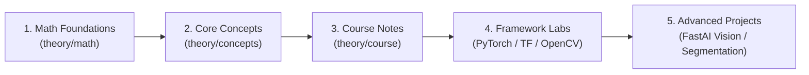

# Deep Learning: Theory & Practice

A structured repository containing deep learning theory notes, computational mathematics foundations, university course curriculum, and hands-on implementation labs across **PyTorch**, **TensorFlow 2.x**, **OpenCV**, and **FastAI**.

---

## 🗂️ Repository Structure

```
DeepLearning/
├── theory/                                # Theoretical foundations and notes
│   ├── math/                              # Computational linear algebra & calculus
│   │   ├── 01-vector-spaces.md
│   │   ├── 02-eigenvalues-diagonalization.md
│   │   └── 03-calculus-and-optimization.md
│   ├── concepts/                          # Core deep learning concepts & derivations
│   │   ├── 01-neural-network-foundations.md
│   │   ├── 02-bias-and-variance.md
│   │   ├── 03-hyperparameters-and-optimization.md
│   │   ├── 04-convolutional-neural-networks.md
│   │   ├── 05-recurrent-neural-networks.md
│   │   ├── 06-nlp-foundations.md
│   │   ├── neural-network-from-scratch.ipynb
│   │   └── images/
│   └── course/                            # University curriculum (25CSA543A - Deep Learning for AI)
│       ├── 01-neural-network-foundations.md
│       ├── 02-cnn-and-rnn.md
│       └── 03-advanced-deep-learning.md
│
└── practice/                              # Hands-on code & framework labs
    ├── pytorch/                           # PyTorch basics and tensor manipulation
    │   ├── 01-numpy-practice.ipynb
    │   ├── 02-pytorch-intro.ipynb
    │   └── 03-pytorch-tensors-lab.ipynb
    ├── tensorflow/                        # TensorFlow 2.x models & pipelines
    │   ├── README.md
    │   ├── 01-tensorflow-intro.ipynb
    │   ├── 02-tensorflow-quick-tour.ipynb
    │   ├── 03-titanic-survival-estimator.ipynb
    │   └── 04-titanic-survival-neural-net.ipynb
    ├── opencv/                            # Image processing & Computer Vision
    │   ├── 01-first-image-basics.ipynb
    │   ├── 02-deep-learning-for-cv.ipynb
    │   ├── cameraman.jpg
    │   └── j.jpg
    └── fastai/                            # High-level vision & segmentation
        └── 01-image-segmentation-camvid.ipynb
```

---

## 📚 Part I: Theory

### 1. Mathematical Foundations (`theory/math/`)
Rigorous computational mathematics required for machine learning and optimization:
* [**01 - Vector Spaces**](theory/math/01-vector-spaces.md): Vector spaces, subspaces, linear independence, spanning sets, basis, dimension, linear transformations, kernel, and image.
* [**02 - Eigenvalues & Diagonalization**](theory/math/02-eigenvalues-diagonalization.md): Determinants, characteristic polynomials, eigenvalues, eigenvectors, matrix diagonalization, and geometric multiplicity.
* [**03 - Calculus & Optimization**](theory/math/03-calculus-and-optimization.md): Limits, derivatives, chain rule, multivariable gradients, directional derivatives, Hessian matrices, Taylor approximations, and Riemann integration.

### 2. Core Concepts (`theory/concepts/`)
Fundamental concepts with mathematical derivations and Python implementations from scratch:
* [**01 - Neural Network Foundations**](theory/concepts/01-neural-network-foundations.md): Logistic regression, binary cross-entropy loss, gradient descent update rule, multi-layer forward propagation, and step-by-step backpropagation derivations.
* [**02 - Bias and Variance**](theory/concepts/02-bias-and-variance.md): Overfitting vs. underfitting, bias-variance decomposition, L1/L2 regularization, dropout, batch normalization, and early stopping.
* [**03 - Hyperparameters & Optimization**](theory/concepts/03-hyperparameters-and-optimization.md): Momentum, RMSProp, Adam optimizers, learning rate decay, grid/random search, and weight initialization (Xavier, He).
* [**04 - Convolutional Neural Networks (CNNs)**](theory/concepts/04-convolutional-neural-networks.md): Kernel operations, stride, padding, receptive fields, pooling layers, and feature maps.
* [**05 - Recurrent Neural Networks (RNNs)**](theory/concepts/05-recurrent-neural-networks.md): Sequential data representation, recurrent connections, vanishing/exploding gradients, LSTM cells, and GRU gates.
* [**06 - NLP Foundations**](theory/concepts/06-nlp-foundations.md): Word representations, Bag-of-Words, TF-IDF, Word2Vec, and language modeling basics.
* [**Neural Network from Scratch**](theory/concepts/neural-network-from-scratch.ipynb): Interactive notebook building logistic regression and simple neural networks with pure NumPy.

### 3. Course Curriculum (`theory/course/`)
Comprehensive lecture notes aligned with **Course 25CSA543A — Deep Learning for AI**:
* [**Unit 1 — Neural Network Foundations**](theory/course/01-neural-network-foundations.md): Perceptrons, XOR problem, Multi-Layer Perceptrons, numerical worked examples for backpropagation, activation functions, optimizers, dataset splits, and initialization.
* [**Unit 2 — CNN and RNN**](theory/course/02-cnn-and-rnn.md): 2D/3D convolutions, pooling, classic vision architectures (LeNet-5, AlexNet, VGGNet, ResNet, Inception), RNN unrolling, Backprop Through Time (BPTT), LSTM/GRU mechanics, bidirectional RNNs, and Seq2Seq.
* [**Unit 3 — Advanced Deep Learning**](theory/course/03-advanced-deep-learning.md): Attention mechanisms, Scaled Dot-Product Attention, Multi-Head Attention, Transformer architecture, Autoencoders, Variational Autoencoders (VAEs), and Generative Adversarial Networks (GANs).

---

## 💻 Part II: Practice Labs

### 1. PyTorch (`practice/pytorch/`)
* [**01 - NumPy Practice**](practice/pytorch/01-numpy-practice.ipynb): Vectorization, broadcasting, array operations, and math essentials.
* [**02 - PyTorch Intro**](practice/pytorch/02-pytorch-intro.ipynb): Tensor creation, datatype casting, GPU acceleration (`cuda`), autograd computation graph.
* [**03 - PyTorch Tensors Lab**](practice/pytorch/03-pytorch-tensors-lab.ipynb): Detailed practice lab covering tensor manipulations and mathematical operations.

### 2. TensorFlow 2.x (`practice/tensorflow/`)
* [**TensorFlow Overview**](practice/tensorflow/README.md): Quick introduction to tensor ranks, shapes, and reshaping.
* [**01 - TensorFlow Introduction**](practice/tensorflow/01-tensorflow-intro.ipynb): Installation, tensor constants/variables, matrix multiplication, and eager execution.
* [**02 - TensorFlow Quick Tour**](practice/tensorflow/02-tensorflow-quick-tour.ipynb): Building and training end-to-end models with TF 2.x and Keras.
* [**03 - Titanic Survival using Estimator**](practice/tensorflow/03-titanic-survival-estimator.ipynb): Data analysis, feature engineering, and classification using `tf.estimator` and feature columns.
* [**04 - Titanic Survival using Neural Network**](practice/tensorflow/04-titanic-survival-neural-net.ipynb): End-to-end binary classification using Keras `Sequential` API.

### 3. OpenCV & Computer Vision (`practice/opencv/`)
* [**01 - First Image Basics**](practice/opencv/01-first-image-basics.ipynb): Image I/O, color spaces (BGR to RGB/Grayscale), thresholding, filtering, and edge detection.
* [**02 - Deep Learning for CV**](practice/opencv/02-deep-learning-for-cv.ipynb): Preprocessing pipelines for feeding vision data into neural network architectures.

### 4. FastAI Applications (`practice/fastai/`)
* [**01 - Image Segmentation (CamVid)**](practice/fastai/01-image-segmentation-camvid.ipynb): Semantic segmentation using FastAI, pretrained U-Net architectures, and learning rate finder.

---

## 🚀 Recommended Learning Path



1. **Foundations**: Start with [Vector Spaces](theory/math/01-vector-spaces.md) and [Calculus](theory/math/03-calculus-and-optimization.md).
2. **Concept Mastery**: Learn [Neural Network Foundations](theory/concepts/01-neural-network-foundations.md) and run [Scratch NN Notebook](theory/concepts/neural-network-from-scratch.ipynb).
3. **Framework Fluency**: Practice tensors and pipelines in [PyTorch](practice/pytorch/) and [TensorFlow](practice/tensorflow/).
4. **Specializations**: Dive into [Computer Vision (OpenCV)](practice/opencv/), [Course Unit 2 (CNN/RNN)](theory/course/02-cnn-and-rnn.md), and [Unit 3 (Transformers & Generative Models)](theory/course/03-advanced-deep-learning.md).

---

## 📄 License

This repository is licensed under the [MIT License](LICENSE).
