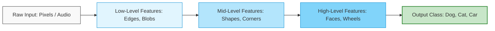
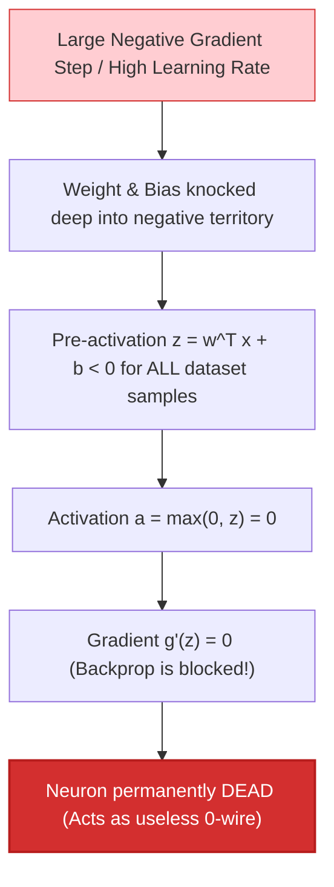
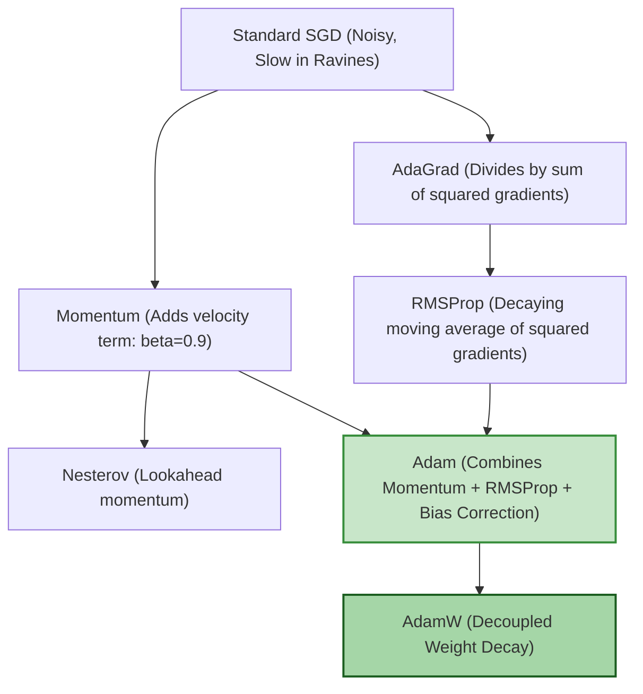
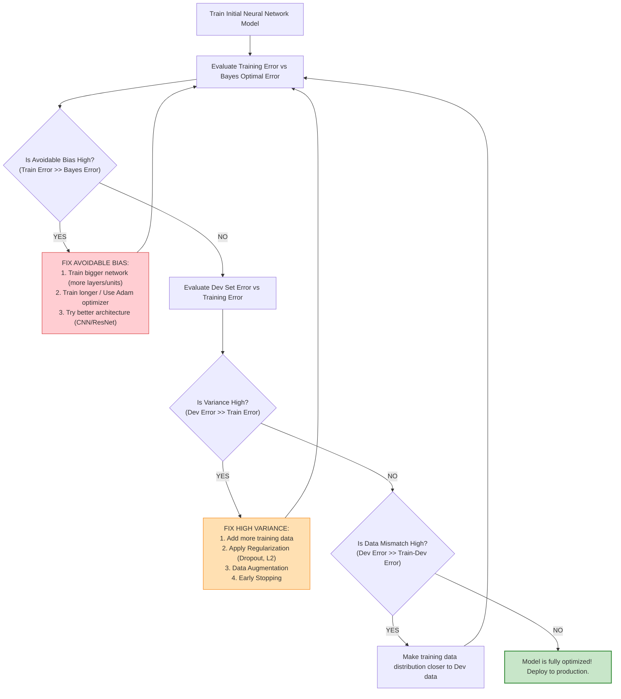

# Unit I — Neural Network Foundations
### 25CSA543A — Deep Learning for Artificial Intelligence

> **Course Level:** Undergraduate / Beginner–Intermediate Deep Learning  
> **Prerequisites:** Basic Calculus (Derivatives, Chain Rule), Linear Algebra (Vectors, Matrices, Dot Products), Python basics  
> **Core Objective:** Master the mathematical, algorithmic, and practical foundations of Artificial Neural Networks — from single artificial neurons to multi-layer feedforward networks, step-by-step numerical backpropagation, loss functions, activation dynamics, modern optimization algorithms, dataset distribution splits, bias-variance diagnostics, and systematic hyperparameter tuning.

---

## Table of Contents
1. [Introduction: Deep Learning & Representation Learning](#1-introduction-deep-learning--representation-learning)
2. [Single-Layer Neural Networks (The Perceptron & Logistic Neuron)](#2-single-layer-neural-networks-the-perceptron--logistic-neuron)
   - [Perceptron Architecture & Decision Boundaries](#perceptron-architecture--decision-boundaries)
   - [The Perceptron Learning Rule & Convergence Theorem](#the-perceptron-learning-rule--convergence-theorem)
   - [The Legendary XOR Problem & Linear Inseparability](#the-legendary-xor-problem--linear-inseparability)
   - [Logistic Regression as a Single-Neuron Network](#logistic-regression-as-a-single-neuron-network)
   - [Binary Cross-Entropy Loss & Maximum Likelihood Estimation](#binary-cross-entropy-loss--maximum-likelihood-estimation)
3. [Multi-Layer Neural Networks (Multi-Layer Perceptron / MLP)](#3-multi-layer-neural-networks-multi-layer-perceptron--mlp)
   - [Architecture: Input, Hidden, and Output Layers](#architecture-input-hidden-and-output-layers)
   - [Matrix Notation for Feedforward Propagation](#matrix-notation-for-feedforward-propagation)
   - [Why Depth Matters: Universal Approximation & Hierarchical Features](#why-depth-matters-universal-approximation--hierarchical-features)
   - [Solving XOR with a 2-Layer Network](#solving-xor-with-a-2-layer-network)
4. [Backpropagation: The Engine of Deep Learning](#4-backpropagation-the-engine-of-deep-learning)
   - [The Automated Chain Rule Intuition](#the-automated-chain-rule-intuition)
   - [Computational Graphs: Forward Pass vs. Backward Pass](#computational-graphs-forward-pass-vs-backward-pass)
   - [Step-by-Step Worked Example 1: Single Logistic Neuron](#step-by-step-worked-example-1-single-logistic-neuron)
   - [Step-by-Step Worked Example 2: Full Numeric 2-Layer Network](#step-by-step-worked-example-2-full-numeric-2-layer-network)
   - [Vectorized Matrix Formulation of Backpropagation](#vectorized-matrix-formulation-of-backpropagation)
5. [Activation Functions: Non-Linear Power & Gradient Dynamics](#5-activation-functions-non-linear-power--gradient-dynamics)
   - [Why Activation Functions are Non-Negotiable](#why-activation-functions-are-non-negotiable)
   - [Comparative Analysis: Sigmoid, Tanh, ReLU, Leaky ReLU, ELU, GELU, Softmax](#comparative-analysis-sigmoid-tanh-relu-leaky-relu-elu-gelu-softmax)
   - [The Dead ReLU Problem & Pathological Saturation](#the-dead-relu-problem--pathological-saturation)
   - [Numerical Stability of Softmax & The LogSumExp Trick](#numerical-stability-of-softmax--the-logsumexp-trick)
   - [Activation Selection Decision Matrix](#activation-selection-decision-matrix)
6. [Gradient Descent & Modern Optimization Algorithms](#6-gradient-descent--modern-optimization-algorithms)
   - [Loss Landscapes, Ill-Conditioned Curvature & Saddle Points](#loss-landscapes-ill-conditioned-curvature--saddle-points)
   - [Batch vs. Stochastic (SGD) vs. Mini-Batch Gradient Descent](#batch-vs-stochastic-sgd-vs-mini-batch-gradient-descent)
   - [Momentum & Nesterov Accelerated Gradient (NAG)](#momentum--nesterov-accelerated-gradient-nag)
   - [Adaptive Learning Rate Methods: AdaGrad, RMSProp, and Adam](#adaptive-learning-rate-methods-adagrad-rmsprop-and-adam)
   - [AdamW: Decoupling Weight Decay from Adaptive Gradients](#adamw-decoupling-weight-decay-from-adaptive-gradients)
   - [Learning Rate Schedules: Step Decay, Exponential, and Cosine Annealing (SGDR)](#learning-rate-schedules-step-decay-exponential-and-cosine-annealing-sgdr)
7. [Dataset Splitting & Distribution Diagnostics](#7-dataset-splitting--distribution-diagnostics)
   - [The Classic Three-Way Split (Train / Dev / Test)](#the-classic-three-way-split-train--dev--test)
   - [Big Data Era Split Ratios (98 / 1 / 1)](#big-data-era-split-ratios-98--1--1)
   - [Handling Data Distribution Mismatches: The Train-Dev Set](#handling-data-distribution-mismatches-the-train-dev-set)
8. [The Bias-Variance Trade-off & Error Analysis](#8-the-bias-variance-trade-off--error-analysis)
   - [Mathematical Decomposition of Generalization Error](#mathematical-decomposition-of-generalization-error)
   - [Underfitting (High Bias) vs. Overfitting (High Variance)](#underfitting-high-bias-vs-overfitting-high-variance)
   - [Andrew Ng's Systematic AI Debugging Recipe](#andrew-ngs-systematic-ai-debugging-recipe)
   - [Regularization Strategies: L1, L2 (Weight Decay), Dropout, and Early Stopping](#regularization-strategies-l1-l2-weight-decay-dropout-and-early-stopping)
9. [Hyperparameter Tuning & Weight Initialization](#9-hyperparameter-tuning--weight-initialization)
   - [Hyperparameter Priority Hierarchy](#hyperparameter-priority-hierarchy)
   - [Grid Search vs. Random Search vs. Bayesian Optimization](#grid-search-vs-random-search-vs-bayesian-optimization)
   - [Logarithmic Scale Sampling for Hyperparameters](#logarithmic-scale-sampling-for-hyperparameters)
   - [Weight Initialization: Symmetry Breaking, Xavier (Glorot), and He (Kaiming)](#weight-initialization-symmetry-breaking-xavier-glorot-and-he-kaiming)
   - [Batch Normalization: Formulation, Gradients & Inference Mechanics](#batch-normalization-formulation-gradients--inference-mechanics)
10. [Unit I Summary & Formula Cheat Sheet](#10-unit-i-summary--formula-cheat-sheet)

---

## 1. Introduction: Deep Learning & Representation Learning

### 1.1 Classical Machine Learning vs. Deep Learning

In **classical machine learning**, human domain experts manually engineer handcrafted features (e.g., SIFT, HOG, edge filters, spectral peaks) from raw input data. The ML model (such as an SVM or Random Forest) only learns a linear or shallow decision boundary on top of these handcrafted features.

In **deep learning**, neural networks perform **end-to-end representation learning**: the network takes raw, unstructured data (pixels, raw audio waveforms, character sequences) and automatically learns a hierarchical cascade of abstract features layer by layer.

```
CLASSICAL MACHINE LEARNING PIPELINE:
Raw Input (Pixels) ---> [ Manual Feature Engineering ] ---> [ Handcrafted Vector ] ---> [ Shallow Classifier ] ---> Output
                         (SIFT, HOG, Color Histograms)

DEEP LEARNING PIPELINE:
Raw Input (Pixels) ---> [ Layer 1: Edges ] ---> [ Layer 2: Textures ] ---> [ Layer 3: Object Parts ] ---> [ Classifier ] ---> Output
                         \__________________________________________________________________________/
                                              Learned Automatically via Backprop!
```



---

## 2. Single-Layer Neural Networks (The Perceptron & Logistic Neuron)

### 2.1 Perceptron Architecture & Decision Boundaries

The **Perceptron**, introduced by Frank Rosenblatt in 1958, is the foundational building block of neural computing. It models a single biological neuron receiving $n$ inputs $x = (x_1, x_2, \dots, x_n)^T \in \mathbb{R}^n$, weighting them by $w = (w_1, w_2, \dots, w_n)^T \in \mathbb{R}^n$, adding a scalar bias $b \in \mathbb{R}$, and passing the pre-activation sum through a threshold step function:

> [!TIP]
> **Physical Metaphor — The Mechanical Balance Scale:**
> Think of a Perceptron as a mechanical balance scale. Each input feature $x_i$ is a coin placed in a tray, multiplied by its metal density (weight $w_i$). The bias $b$ is a counterweight on the opposite side. If the total torque exceeds the counterweight ($z \ge 0$), the scale abruptly tips and rings an electric bell ($\hat{y} = 1$).

$$z = w^T x + b = \sum_{i=1}^n w_i x_i + b$$

$$\hat{y} = f(z) = \begin{cases} 1 & \text{if } z \ge 0 \\ 0 & \text{if } z < 0 \end{cases}$$

```
                           PERCEPTRON COMPUTATIONAL GRAPH
 x1 (Feature 1) --- (w1) ---\
 x2 (Feature 2) --- (w2) ----> [ Linear Sum: z = w^T x + b ] ---> [ Heaviside Step Function ] ---> Output y_hat in {0, 1}
 xn (Feature n) --- (wn) ---/               ^
                                            |
 Bias b ------------------------------------+
```

#### Geometric Interpretation of the Decision Boundary
The equation $w^T x + b = 0$ defines an $(n-1)$-dimensional **hyperplane** separating $\mathbb{R}^n$ into two half-spaces:
- Points with $w^T x + b \ge 0$ are classified as $\hat{y} = 1$.
- Points with $w^T x + b < 0$ are classified as $\hat{y} = 0$.
- The weight vector $w$ is the **normal vector** perpendicular to the decision boundary hyperplane.
- The scalar bias $b$ determines the perpendicular distance from the origin to the hyperplane: $\text{dist} = \frac{-b}{\|w\|_2}$.

---

### 2.2 The Perceptron Learning Rule & Convergence Theorem

Given training samples $\{(x^{(i)}, y^{(i)})\}_{i=1}^m$ where $y^{(i)} \in \{0, 1\}$, the weights are updated iteratively whenever the model makes an error:

$$w \leftarrow w + \eta \, (y^{(i)} - \hat{y}^{(i)}) \, x^{(i)}$$
$$b \leftarrow b + \eta \, (y^{(i)} - \hat{y}^{(i)})$$

Where $\eta \in (0, 1]$ is the learning rate.

#### Novikoff's Perceptron Convergence Theorem (1962)
Assume the training dataset is **linearly separable** under bipolar labels $y^{(i)} \in \{-1, +1\}$ by an optimal unit hyperparameter vector $w^*$ with margin $\gamma = \min_i y^{(i)}(w^{*T} x^{(i)} + b^*) > 0$, bounded by maximum sample radius $R = \max_i \|x^{(i)}\|_2$. The Perceptron algorithm makes at most $k$ mistake updates before separating all points perfectly:

$$\boxed{k \le \left( \frac{R}{\gamma} \right)^2 \text{ mistake updates}}$$

> [!CAUTION]
> **Fatal Flaw of the Perceptron:** If the dataset is **not linearly separable**, the perceptron learning algorithm will cycle infinitely and never converge!

---

### 2.3 The Legendary XOR Problem & Linear Inseparability

In 1969, Marvin Minsky and Seymour Papert published *Perceptrons*, proving mathematically that a single-layer perceptron cannot solve non-linearly separable logic functions like **XOR (Exclusive OR)** or **XNOR**.

```
    AND GATE (Linearly Separable)                XOR GATE (Linearly Inseparable!)
    x2 ^                                         x2 ^
       |                                            |
     1 +      O (0)        * (1)                  1 +      * (1)        O (0)
       |             \                              |
       |              \  Boundary                   |         ??? NO SINGLE LINE ???
     0 +      O (0)    \   O (0)                  0 +      O (0)        * (1)
       +--------+--------+--------> x1              +--------+--------+--------> x1
       0        1                                   0        1
```

To solve XOR, we need **non-linear feature combinations** or a **multi-layer network** that projects the data into a higher-dimensional space where it becomes linearly separable.

---

### 2.4 Logistic Regression as a Single-Neuron Network

To output continuous, differentiable probabilities rather than binary $\{0, 1\}$ step decisions, we replace the discontinuous step function with the **Sigmoid (Logistic) activation function**:

$$\sigma(z) = \frac{1}{1 + e^{-z}}$$

$$\hat{y} = P(y=1 \mid x) = \sigma(w^T x + b) = \frac{1}{1 + e^{-(w^T x + b)}}$$

#### Key Mathematical Properties of Sigmoid:
1. **Bounded Output Range:** $\sigma(z) \in (0, 1)$, ideal for modeling Bernoulli class probabilities.
2. **Symmetry:** $\sigma(-z) = 1 - \sigma(z)$.
3. **Elegant Differentiability:**
   $$\frac{d\sigma(z)}{dz} = \sigma(z)(1 - \sigma(z))$$

*Proof:*
$$\frac{d}{dz}(1 + e^{-z})^{-1} = -(1 + e^{-z})^{-2}(-e^{-z}) = \frac{e^{-z}}{(1 + e^{-z})^2} = \left(\frac{1}{1+e^{-z}}\right)\left(\frac{e^{-z}}{1+e^{-z}}\right) = \sigma(z)(1 - \sigma(z)) \quad \blacksquare$$

---

### 2.5 Binary Cross-Entropy Loss & Maximum Likelihood Estimation

Why can't we use Mean Squared Error (MSE) $L = \frac{1}{2}(\hat{y} - y)^2$ for logistic regression?
Because substituting $\hat{y} = \sigma(w^T x + b)$ into MSE creates a **non-convex loss surface** with multiple deceptive local minima and severe gradient saturation!

#### Derivation via Maximum Likelihood Estimation (MLE)
For a binary classification task with $y \in \{0, 1\}$, the likelihood of a single sample is modeled as a Bernoulli trial:
$$P(y \mid x; w, b) = \hat{y}^y \, (1 - \hat{y})^{1 - y}$$

Taking the natural logarithm of likelihood:
$$\log P(y \mid x; w, b) = y \log \hat{y} + (1 - y) \log(1 - \hat{y})$$

Maximizing likelihood is mathematically equivalent to minimizing the **Negative Log-Likelihood (Binary Cross-Entropy Loss)**:

$$\mathcal{L}(\hat{y}, y) = - \left[ y \log \hat{y} + (1 - y) \log(1 - \hat{y}) \right]$$

For an entire dataset of $m$ independent training samples, the total cost function is:

$$J(w, b) = \frac{1}{m} \sum_{i=1}^m \mathcal{L}(\hat{y}^{(i)}, y^{(i)}) = - \frac{1}{m} \sum_{i=1}^m \left[ y^{(i)} \log \hat{y}^{(i)} + (1 - y^{(i)}) \log(1 - \hat{y}^{(i)}) \right]$$

---

## 3. Multi-Layer Neural Networks (Multi-Layer Perceptron / MLP)

### 3.1 Architecture: Input, Hidden, and Output Layers

A **Multi-Layer Perceptron (MLP)** stacks multiple computational layers between input and output:

```
INPUT LAYER (l=0)          HIDDEN LAYER 1 (l=1)         HIDDEN LAYER 2 (l=2)          OUTPUT LAYER (l=3)
  n^[0] = 3 nodes             n^[1] = 4 nodes              n^[2] = 4 nodes              n^[3] = 1 node

     ( x_1 ) ---------------> ( a_1^[1] ) -------------> ( a_1^[2] )
            \             /              \             /              \
     ( x_2 ) ---------------> ( a_2^[1] ) -------------> ( a_2^[2] ) ---> ( a_1^[3] = y_hat )
            /             \              /             \              /
     ( x_3 ) ---------------> ( a_3^[1] ) -------------> ( a_3^[2] )
                           \              /
                            > ( a_4^[1] ) -------------> ( a_4^[2] )
```

---

### 3.2 Matrix Notation for Feedforward Propagation

For any layer $l \in \{1, 2, \dots, L\}$:
- $n^{[l]}$: Number of neurons in layer $l$.
- $W^{[l]} \in \mathbb{R}^{n^{[l]} \times n^{[l-1]}}$: Weight matrix of layer $l$.
- $b^{[l]} \in \mathbb{R}^{n^{[l]} \times 1}$: Bias vector of layer $l$.
- $g^{[l]}(\cdot)$: Non-linear activation function of layer $l$.
- $z^{[l]} \in \mathbb{R}^{n^{[l]} \times 1}$: Pre-activation vector.
- $a^{[l]} \in \mathbb{R}^{n^{[l]} \times 1}$: Post-activation output ($a^{[0]} = x$).

#### Layer-by-Layer Forward Pass Equations:
$$z^{[l]} = W^{[l]} a^{[l-1]} + b^{[l]}$$
$$a^{[l]} = g^{[l]}(z^{[l]})$$

#### Vectorized Batch Form (for $m$ training examples simultaneously):
Let $X \in \mathbb{R}^{n^{[0]} \times m}$ be the data matrix where each column is an input example:
$$Z^{[l]} = W^{[l]} A^{[l-1]} + b^{[l]} \qquad (Z^{[l]} \in \mathbb{R}^{n^{[l]} \times m})$$
$$A^{[l]} = g^{[l]}(Z^{[l]}) \qquad (A^{[l]} \in \mathbb{R}^{n^{[l]} \times m})$$

*(Note: $b^{[l]}$ is broadcast column-wise across all $m$ columns via NumPy/PyTorch broadcasting).*

---

### 3.3 Why Depth Matters: Universal Approximation & Hierarchical Features

#### The Universal Approximation Theorem (Cybenko, 1989; Hornik, 1991)
> A standard feedforward neural network with a single hidden layer containing a finite number of non-linear neurons can approximate **any continuous function** on compact subsets of $\mathbb{R}^n$ to arbitrary accuracy $\epsilon > 0$.

#### The Deep vs. Wide Catch:
Although a single hidden layer *theoretically* can approximate any function, it may require an **exponentially large number of hidden neurons** ($\mathcal{O}(2^n)$), making it impossible to train or generalize!

In contrast, **deep architectures** factor complex mathematical mappings into a composition of simpler functions:
$$f(x) = g_L(W_L \, g_{L-1}(\cdots g_1(W_1 x + b_1) \cdots) + b_L)$$
This hierarchical composition allows deep networks to learn rich combinatorial features with exponentially fewer total parameters ($\mathcal{O}(\text{poly}(n))$).

---

### 3.4 Solving XOR with a 2-Layer Network

Let's build an explicit 2-layer network with step activation that solves XOR:

$$\text{XOR}(x_1, x_2) = (x_1 \text{ OR } x_2) \text{ AND } \text{NOT}(x_1 \text{ AND } x_2)$$

```
Hidden Neuron h1 (Computes OR):   z_1 = 1*x_1 + 1*x_2 - 0.5  --> h1 = step(z_1)
Hidden Neuron h2 (Computes NAND): z_2 = -1*x_1 - 1*x_2 + 1.5 --> h2 = step(z_2)
Output Neuron y (Computes AND):   z_out = 1*h1 + 1*h2 - 1.5  --> y = step(z_out)
```

#### Truth Table Verification:
| $x_1$ | $x_2$ | $h_1 = \text{OR}(x_1, x_2)$ | $h_2 = \text{NAND}(x_1, x_2)$ | $z_{\text{out}} = h_1 + h_2 - 1.5$ | $\hat{y} = \text{step}(z_{\text{out}})$ | True XOR |
|:---:|:---:|:---:|:---:|:---:|:---:|:---:|
| 0 | 0 | 0 | 1 | $-0.5$ | **0** | 0 |
| 0 | 1 | 1 | 1 | $+0.5$ | **1** | 1 |
| 1 | 0 | 1 | 1 | $+0.5$ | **1** | 1 |
| 1 | 1 | 1 | 0 | $-0.5$ | **0** | 0 |

The hidden layer transforms the 2D input space into a new feature space $(h_1, h_2)$ where the data becomes **linearly separable**!

---

## 4. Backpropagation: The Engine of Deep Learning

### 4.1 The Automated Chain Rule Intuition

Training a neural network means finding parameter values $\theta = \{W^{[l]}, b^{[l]}\}_{l=1}^L$ that minimize the cost function $J(\theta)$. Using Gradient Descent:

$$W^{[l]} \leftarrow W^{[l]} - \eta \frac{\partial J}{\partial W^{[l]}}, \qquad b^{[l]} \leftarrow b^{[l]} - \eta \frac{\partial J}{\partial b^{[l]}}$$

**Backpropagation** is an efficient application of the multivariate **Chain Rule of Calculus** to compute these partial derivatives recursively from the output layer backwards to the input layer.

> [!TIP]
> **Physical Metaphor — The Acoustic Echo Chamber:**
> Imagine a sequence of connected acoustic rooms. In the forward pass, you speak at the entrance ($x$), and each room alters the sound pitch ($W^{[l]}a^{[l-1]} + b^{[l]}$) until a final note plays at the exit. If the note is off-pitch (Loss $J$), you shout an error correction back into the exit. The sound waves echo in reverse; each doorway's acoustic microphone measures exactly how much its own wall angle contributed to the final off-pitch sound.

```
FORWARD PASS  : Compute activations from left to right:   x ---> a^[1] ---> a^[2] ---> ... ---> a^[L] ---> Loss J
BACKWARD PASS : Propagate errors from right to left:     dL/dx <-- dL/da^[1] <-- ... <-- dL/da^[L] <--- dL/dJ
```

---

### 4.2 Step-by-Step Worked Example 1: Single Logistic Neuron

Let's derive the exact gradient for a single logistic regression neuron with BCE loss:

```
x ---> ( * w ) ---> z ---> ( sigma ) ---> y_hat ---> ( Loss ) ---> L
        ^           ^
b ------+           |
```

1. **Loss Function:**
   $$\mathcal{L} = - [y \log \hat{y} + (1-y)\log(1-\hat{y})]$$
   $$\frac{\partial \mathcal{L}}{\partial \hat{y}} = - \frac{y}{\hat{y}} + \frac{1-y}{1-\hat{y}} = \frac{\hat{y} - y}{\hat{y}(1-\hat{y})}$$

2. **Activation Function:**
   $$\hat{y} = \sigma(z) \implies \frac{\partial \hat{y}}{\partial z} = \hat{y}(1 - \hat{y})$$

3. **Pre-activation Gradient ($dz$):**
   $$dz = \frac{\partial \mathcal{L}}{\partial z} = \frac{\partial \mathcal{L}}{\partial \hat{y}} \cdot \frac{\partial \hat{y}}{\partial z} = \left( \frac{\hat{y} - y}{\hat{y}(1-\hat{y})} \right) \cdot \hat{y}(1-\hat{y}) = \mathbf{\hat{y} - y}$$

   > [!NOTE]
   > The non-linear derivative terms cancel out cleanly! The error signal $dz = \hat{y} - y$ is simply **(Prediction $-$ Target)**.

4. **Weight and Bias Gradients:**
   $$\frac{\partial \mathcal{L}}{\partial w} = \frac{\partial \mathcal{L}}{\partial z} \cdot \frac{\partial z}{\partial w} = dz \cdot x = (\hat{y} - y) x$$
   $$\frac{\partial \mathcal{L}}{\partial b} = \frac{\partial \mathcal{L}}{\partial z} \cdot \frac{\partial z}{\partial b} = dz \cdot 1 = (\hat{y} - y)$$

---

### 4.3 Step-by-Step Worked Example 2: Full Numeric 2-Layer Network

Let's trace a complete numeric forward and backward pass for a small 2-layer network:
- Input: $x = [0.5, 0.8]^T$, True Label: $y = 1$.
- Learning Rate: $\eta = 0.5$.
- Architecture: 2 inputs $\to$ 2 hidden neurons (Sigmoid) $\to$ 1 output neuron (Sigmoid).

```
Initial Weights & Biases:
W^[1] = [[0.1, 0.4],     b^[1] = [0.1, 0.2]^T
         [0.2, 0.3]]
W^[2] = [[0.6, 0.7]],    b^[2] = [0.3]
```

#### Step 1: Forward Propagation
1. **Hidden Layer 1:**
   $$z_1^{[1]} = w_{11}^{[1]}x_1 + w_{12}^{[1]}x_2 + b_1^{[1]} = (0.1)(0.5) + (0.4)(0.8) + 0.1 = 0.05 + 0.32 + 0.1 = 0.47$$
   $$z_2^{[1]} = w_{21}^{[1]}x_1 + w_{22}^{[1]}x_2 + b_2^{[1]} = (0.2)(0.5) + (0.3)(0.8) + 0.2 = 0.10 + 0.24 + 0.2 = 0.54$$
   $$a_1^{[1]} = \sigma(0.47) = \frac{1}{1 + e^{-0.47}} \approx 0.6154$$
   $$a_2^{[1]} = \sigma(0.54) = \frac{1}{1 + e^{-0.54}} \approx 0.6318$$

2. **Output Layer 2:**
   $$z_1^{[2]} = w_{11}^{[2]}a_1^{[1]} + w_{12}^{[2]}a_2^{[1]} + b^{[2]} = (0.6)(0.6154) + (0.7)(0.6318) + 0.3 = 0.3692 + 0.4423 + 0.3 = 1.1115$$
   $$\hat{y} = a_1^{[2]} = \sigma(1.1115) = \frac{1}{1 + e^{-1.1115}} \approx 0.7524$$

3. **Loss Computation:**
   $$\mathcal{L} = - [1 \cdot \log(0.7524) + 0 \cdot \log(1 - 0.7524)] = -(-0.2845) \approx \mathbf{0.2845}$$

---

#### Step 2: Backward Propagation
1. **Output Layer Gradients:**
   $$dz_1^{[2]} = \hat{y} - y = 0.7524 - 1.0 = \mathbf{-0.2476}$$
   $$\frac{\partial \mathcal{L}}{\partial W^{[2]}} = dz_1^{[2]} \cdot (a^{[1]})^T = -0.2476 \cdot [0.6154, 0.6318] = [\mathbf{-0.1524}, \mathbf{-0.1564}]$$
   $$\frac{\partial \mathcal{L}}{\partial b^{[2]}} = dz_1^{[2]} = \mathbf{-0.2476}$$

2. **Hidden Layer Gradients:**
   $$da^{[1]} = (W^{[2]})^T \cdot dz_1^{[2]} = \begin{pmatrix} 0.6 \\ 0.7 \end{pmatrix} (-0.2476) = \begin{pmatrix} -0.1486 \\ -0.1733 \end{pmatrix}$$
   $$g'^{[1]}(z^{[1]}) = a^{[1]} \odot (1 - a^{[1]}) = \begin{pmatrix} 0.6154(1 - 0.6154) \\ 0.6318(1 - 0.6318) \end{pmatrix} = \begin{pmatrix} 0.2367 \\ 0.2326 \end{pmatrix}$$
   $$dz^{[1]} = da^{[1]} \odot g'^{[1]}(z^{[1]}) = \begin{pmatrix} -0.1486 \times 0.2367 \\ -0.1733 \times 0.2326 \end{pmatrix} = \begin{pmatrix} \mathbf{-0.0352} \\ \mathbf{-0.0403} \end{pmatrix}$$
   $$\frac{\partial \mathcal{L}}{\partial W^{[1]}} = dz^{[1]} \cdot x^T = \begin{pmatrix} -0.0352 \\ -0.0403 \end{pmatrix} \begin{pmatrix} 0.5 & 0.8 \end{pmatrix} = \begin{pmatrix} \mathbf{-0.0176} & \mathbf{-0.0282} \\ \mathbf{-0.0202} & \mathbf{-0.0322} \end{pmatrix}$$
   $$\frac{\partial \mathcal{L}}{\partial b^{[1]}} = dz^{[1]} = \begin{pmatrix} \mathbf{-0.0352} \\ \mathbf{-0.0403} \end{pmatrix}$$

---

#### Step 3: Gradient Descent Weight Updates ($\eta = 0.5$)
$$W^{[2]}_{\text{new}} = W^{[2]} - \eta \frac{\partial \mathcal{L}}{\partial W^{[2]}} = [0.6, 0.7] - 0.5[-0.1524, -0.1564] = [\mathbf{0.6762}, \mathbf{0.7782}]$$
$$b^{[2]}_{\text{new}} = 0.3 - 0.5(-0.2476) = \mathbf{0.4238}$$
$$W^{[1]}_{\text{new}} = \begin{pmatrix} 0.1 & 0.4 \\ 0.2 & 0.3 \end{pmatrix} - 0.5 \begin{pmatrix} -0.0176 & -0.0282 \\ -0.0202 & -0.0322 \end{pmatrix} = \begin{pmatrix} \mathbf{0.1088} & \mathbf{0.4141} \\ \mathbf{0.2101} & \mathbf{0.3161} \end{pmatrix}$$
$$b^{[1]}_{\text{new}} = \begin{pmatrix} 0.1 \\ 0.2 \end{pmatrix} - 0.5 \begin{pmatrix} -0.0352 \\ -0.0403 \end{pmatrix} = \begin{pmatrix} \mathbf{0.1176} \\ \mathbf{0.2202} \end{pmatrix}$$

---

### 4.4 Vectorized Matrix Formulation of Backpropagation

For a mini-batch of size $m$, where $A^{[l]} \in \mathbb{R}^{n^{[l]} \times m}$:

$$\boxed{dZ^{[L]} = A^{[L]} - Y} \qquad \text{(For Softmax / Sigmoid with Cross-Entropy)}$$

For layer $l = L-1, L-2, \dots, 1$:
$$\boxed{dZ^{[l]} = \left( (W^{[l+1]})^T dZ^{[l+1]} \right) \odot g'^{[l]}(Z^{[l]})}$$

Parameter gradients accumulated across the batch:
$$\boxed{dW^{[l]} = \frac{1}{m} dZ^{[l]} (A^{[l-1]})^T}$$
$$\boxed{db^{[l]} = \frac{1}{m} \sum_{i=1}^m dZ^{[l](i)} = \frac{1}{m} \text{np.sum}(dZ^{[l]}, \text{axis}=1, \text{keepdims}=\text{True})}$$

---

## 5. Activation Functions: Non-Linear Power & Gradient Dynamics

### 5.1 Why Activation Functions are Non-Negotiable

If all activation functions in an $L$-layer neural network are linear ($g(z) = z$), the entire network collapses into a single linear transformation:
$$a^{[L]} = W^{[L]} (W^{[L-1]}(\cdots (W^{[1]} x + b^{[1]}) \cdots) + b^{[L-1]}) + b^{[L]} = W_{\text{effective}} x + b_{\text{effective}}$$
No matter how many millions of layers or billions of weights you stack, a linear network can only learn a **linear decision boundary**. Non-linear activations are required to bend and warp the feature space to separate complex patterns.

---

### 5.2 Comparative Analysis of Activation Functions

```
SIGMOID: sigma(z) = 1/(1+e^-z)        TANH: tanh(z) = (e^z - e^-z)/(e^z + e^-z)       RELU: max(0, z)
       y ^                                   y ^                                             y ^
     1 +        .-------                   1 +        .-------                             3 +          /
       |       /                             |       /                                     2 +        /
   0.5 +      /                            0 +------+-------> z                            1 +      /
       |     /                            -1 + ____/                                       0 +-----+-----> z
     0 +____'--------> z                                                                     -3 -2 -1 0 1 2 3
      -4 -2  0  2  4                        -3 -2 -1 0 1 2 3
```

| Activation | Mathematical Formula | Output Range | Derivative $g'(z)$ | Max Derivative | Zero-Centered? | Primary Caveat / Failure Mode |
|:---|:---|:---:|:---:|:---:|:---:|:---|
| **Sigmoid** | $\sigma(z) = \frac{1}{1 + e^{-z}}$ | $(0, 1)$ | $\sigma(z)(1 - \sigma(z))$ | $0.25$ | ❌ No | Vanishing gradients for $|z| > 4$; outputs strictly positive (zigzag updates). |
| **Tanh** | $\tanh(z) = \frac{e^z - e^{-z}}{e^z + e^{-z}}$ | $(-1, 1)$ | $1 - \tanh^2(z)$ | $1.0$ | ✅ Yes | Vanishing gradients for $|z| > 3$. |
| **ReLU** | $\max(0, z)$ | $[0, \infty)$ | $\begin{cases} 1 & z > 0 \\ 0 & z < 0 \end{cases}$ | $1.0$ | ❌ No | **Dying ReLU Problem**: permanently deactivates if $z < 0$. |
| **Leaky ReLU** | $\max(\alpha z, z), \; \alpha \approx 0.01$ | $(-\infty, \infty)$ | $\begin{cases} 1 & z > 0 \\ \alpha & z \le 0 \end{cases}$ | $1.0$ | ⚠️ Approximate | Prevents dead neurons; $\alpha$ is a fixed heuristic. |
| **ELU** | $\begin{cases} z & z > 0 \\ \alpha(e^z - 1) & z \le 0 \end{cases}$ | $(-\alpha, \infty)$ | $\begin{cases} 1 & z > 0 \\ g(z) + \alpha & z \le 0 \end{cases}$ | $1.0$ | ✅ Closer | Computationally expensive due to exponentiation $\exp(z)$. |
| **GELU** | $z \cdot \Phi(z) = z \cdot P(X \le z)$ | $[-0.17, \infty)$ | Differentiable smooth | $\approx 1.12$ | ⚠️ Approximate | Standard in modern Transformers (BERT, GPT-4, LLaMA). |
| **Softmax** | $\frac{e^{z_i}}{\sum_{j=1}^C e^{z_j}}$ | $(0, 1), \; \sum=1$ | $\hat{y}_i(\delta_{ij} - \hat{y}_j)$ | $0.25$ | ❌ No | Used exclusively at **Multi-Class Output Layers**. |

---

### 5.3 The Dead ReLU Problem & Pathological Saturation

When a neuron with ReLU activation receives inputs that cause $z = w^T x + b \le 0$:
1. The activation outputs $a = 0$.
2. The derivative is strictly $g'(z) = 0$.
3. During backpropagation, $dz = da \odot 0 = 0$.
4. Parameter gradient $dW = dz \cdot x^T = 0$.

If a large negative gradient update knocks a neuron's bias deeply negative, $z$ will remain negative for **all future training examples**. That neuron's weights will never update again—it is **permanently dead**!



#### Mitigations:
1. **Lower the Learning Rate:** Prevents destructive overshoot.
2. **Use Leaky ReLU / PReLU / GELU:** Keeps a small gradient slope ($\alpha = 0.01$) on the negative half-axis so dead neurons can recover.
3. **Proper Weight Initialization:** Use **He Initialization** to maintain balanced activation variance.

---

### 5.4 Numerical Stability of Softmax & The LogSumExp Trick

Naively computing $\text{softmax}(z)_i = \frac{e^{z_i}}{\sum_{j=1}^C e^{z_j}}$ in 32-bit floating point crashes if any $z_i > 88$ because $e^{88} \approx 1.6 \times 10^{38}$ (the limit of `float32`), causing **floating-point overflow (`NaN`)**.

#### The Invariant Shift Trick:
Softmax is mathematically invariant to constant shifts: $\text{softmax}(z) = \text{softmax}(z - c)$. Setting $c = \max(z)$:

$$\text{softmax}(z)_i = \frac{e^{z_i - \max(z)}}{\sum_{j=1}^C e^{z_j - \max(z)}}$$
Since the maximum exponent is now $e^0 = 1$, overflow is strictly impossible!

---

## 6. Gradient Descent & Modern Optimization Algorithms

### 6.1 Loss Landscapes, Ill-Conditioned Curvature & Saddle Points

In high-dimensional deep neural networks, local minima are rare; the primary obstacles are **saddle points** (where gradients vanish in some directions while curving upwards in others) and **ill-conditioned ravines** (where the surface curves much more steeply in one direction than another).

```
         ILL-CONDITIONED RAVINE                         MOMENTUM DAMPING
  w2 ^                                            w2 ^
     |   \   /   \   /                               |   --------------->
     |    \ /     \ /                                |     Accelerates smoothly
     |     V       V   (Oscillates wildly!)          |     along ravine floor!
     +----------------------> w1                     +----------------------> w1
```

---

### 6.2 Comparison of Optimization Algorithms



#### Detailed Optimizer Formulations:

> [!TIP]
> **Physical Metaphors — The Evolution of Optimizers:**
> - **Vanilla SGD (Ping-Pong Ball):** Extremely lightweight; easily bounced sideways by tiny bumps in the terrain.
> - **Momentum (Heavy Iron Bowling Ball):** Accumulates velocity along the main descent slope, effortlessly smashing through shallow local potholes and damping cross-axis oscillations.
> - **RMSProp (Adaptive Hydraulic Shock Absorber):** Automatically stiffens resistance on axes with violent bumpy oscillations while remaining compliant along smooth flat highways.
> - **Adam (High-End Sports Car):** Combines a heavy flywheel (Momentum) with automatic active suspension (RMSProp) and an initial cold-start accelerator (Bias Correction).

1. **SGD with Momentum:**
   $$v_t = \beta v_{t-1} + (1 - \beta) g_t \qquad (\beta \approx 0.9)$$
   $$\theta_{t+1} = \theta_t - \eta v_t$$
   *(Alternative PyTorch Formulation: $v_t = \beta v_{t-1} + g_t$ with $\theta_{t+1} = \theta_t - \eta v_t$).*

2. **RMSProp (Root Mean Square Propagation):**
   $$s_t = \beta_2 s_{t-1} + (1 - \beta_2) g_t^2 \qquad (\beta_2 \approx 0.999)$$
   $$\theta_{t+1} = \theta_t - \frac{\eta}{\sqrt{s_t + \epsilon}} \odot g_t$$

3. **Adam (Adaptive Moment Estimation):**
   - 1st Moment (Mean velocity / Momentum): $m_t = \beta_1 m_{t-1} + (1 - \beta_1) g_t$ ($\beta_1 = 0.9$)
   - 2nd Moment (Uncentered variance / RMSProp): $v_t = \beta_2 v_{t-1} + (1 - \beta_2) g_t^2$ ($\beta_2 = 0.999$)
   - **Bias Corrections:** Since $m_0 = 0, v_0 = 0$, early estimates are biased toward zero:
     $$\hat{m}_t = \frac{m_t}{1 - \beta_1^t}, \qquad \hat{v}_t = \frac{v_t}{1 - \beta_2^t}$$
   - **Parameter Update:**
     $$\theta_{t+1} = \theta_t - \frac{\eta}{\sqrt{\hat{v}_t} + \epsilon} \hat{m}_t$$

---

### 6.3 AdamW: Decoupling Weight Decay from Adaptive Gradients

In standard SGD, L2 regularization ($\frac{1}{2} \lambda \|\theta\|^2$) is mathematically identical to weight decay.
However, in **Adam with L2 regularization**, the gradient becomes $g_t + \lambda \theta$. When Adam divides this by $\sqrt{\hat{v}_t}$, weights with large historical gradients receive **much weaker regularization**, while weights with tiny gradients are penalized excessively!

**AdamW (Loshchilov & Hutter, 2017)** decouples weight decay by subtracting it directly from the weights outside the adaptive gradient step:

$$\theta_{t+1} = \theta_t - \eta \lambda \theta_t - \frac{\eta}{\sqrt{\hat{v}_t} + \epsilon} \hat{m}_t$$

> [!TIP]
> Always use **AdamW** instead of standard Adam when training Transformers or deep vision models with weight decay.

---

### 6.4 Learning Rate Schedules: Cosine Annealing (SGDR)

Rather than keeping $\eta$ constant, decaying the learning rate allows the optimizer to settle into narrow, high-generalization minima.

**Cosine Annealing Schedule:**
$$\eta_t = \eta_{\min} + \frac{1}{2}(\eta_{\max} - \eta_{\min})\left( 1 + \cos\left(\frac{t}{T_{\max}} \pi\right) \right)$$

```
Learning Rate Schedule Curve:
eta ^
    |  *
    |    *
    |       *
    |          *
    |             *
    |               *
0.0 +-----------------*-----> Epochs (T_max)
```

---

## 7. Dataset Splitting & Distribution Diagnostics

### 7.1 The Three-Way Split & Modern Big Data Splits

```
TRADITIONAL ML SPLIT (Small Datasets: m < 100,000):
+------------------------------------+------------------+------------------+
|           TRAIN (60%)              |     DEV (20%)    |    TEST (20%)    |
+------------------------------------+------------------+------------------+

MODERN DEEP LEARNING SPLIT (Big Data: m > 1,000,000):
+------------------------------------------------------------------+---+---+
|                          TRAIN (98%)                             |DEV|TST| (1% each = 10,000+ samples!)
+------------------------------------------------------------------+---+---+
```

- **Training Set:** Used by Backpropagation to optimize weights and biases.
- **Development (Validation) Set:** Used to tune hyperparameters, select architectures, and trigger Early Stopping.
- **Test Set:** Used strictly **ONCE** at the very end to compute an unbiased estimate of real-world generalization performance.

---

### 7.2 Handling Data Distribution Mismatches: The Train-Dev Set

In many real-world applications, training data is sourced from easily available internet scrapes (e.g., high-res DSLR web photos), while the target application runs on low-res mobile phone camera uploads.

> [!IMPORTANT]
> **Golden Rule of Data Splitting:** The **Dev and Test sets MUST come from the exact same target distribution** as your final production environment!

To distinguish whether a high Dev error is caused by **overfitting** or a **data distribution mismatch**, create a **Training-Dev Set** (a slice of training distribution that is set aside and never trained on):

```
+-----------------------------------------+-----------------------------------------+
|      TRAINING DATA DISTRIBUTION         |        TARGET PRODUCTION DISTRIBUTION   |
|         (High-Res Web Scrapes)          |            (Low-Res Mobile Uploads)     |
+--------------------+--------------------+--------------------+--------------------+
|   TRAINING SET     |  TRAINING-DEV SET  |      DEV SET       |      TEST SET      |
|    (Trained on)    |  (Not trained on)  |  (Not trained on)  |  (Not trained on)  |
+--------------------+--------------------+--------------------+--------------------+
```

#### Diagnostic Table:
| Case | Train Error | Train-Dev Error | Dev Error | Diagnosis | Primary Fix |
|:---:|:---:|:---:|:---:|:---|:---|
| **A** | $1\%$ | $1.1\%$ | $1.2\%$ | **Excellent Generalization** | Ready for production deployment! |
| **B** | $10\%$ | $10.2\%$ | $10.5\%$ | **High Avoidable Bias (Underfitting)** | Larger network, longer training, advanced optimizer. |
| **C** | $1\%$ | $8.5\%$ | $9.0\%$ | **High Variance (Overfitting)** | Regularization (Dropout, L2), more training data. |
| **D** | $1\%$ | $1.2\%$ | $9.5\%$ | **Data Distribution Mismatch** | Data synthesis, collect more mobile-like training data. |
| **E** | $10\%$ | $10.5\%$ | $18.0\%$ | **High Bias + Data Mismatch** | Increase model capacity + align training data distribution. |

---

## 8. The Bias-Variance Trade-off & Error Analysis

### 8.1 Mathematical Decomposition of Generalization Error

For a true target function $y = f(x) + \epsilon$ with zero-mean noise $\mathbb{E}[\epsilon]=0, \text{Var}(\epsilon)=\sigma_\epsilon^2$, the expected Mean Squared Error of a model $\hat{f}(x)$ decomposes as:

$$\mathbb{E}[(y - \hat{f}(x))^2] = \underbrace{\left( \mathbb{E}[\hat{f}(x)] - f(x) \right)^2}_{\text{Bias}^2 \text{ (Underfitting)}} + \underbrace{\mathbb{E}\left[ (\hat{f}(x) - \mathbb{E}[\hat{f}(x)])^2 \right]}_{\text{Variance (Overfitting)}} + \underbrace{\sigma_\epsilon^2}_{\text{Irreducible Noise}}$$

```
       HIGH BIAS (Underfitting)             BALANCED (Optimal)            HIGH VARIANCE (Overfitting)
  y ^                                  y ^                               y ^
    |       *      *                     |       *      *                  |       *      *
    |     *  \    /  *                   |     *  .---.  *                 |     * / \  / \ *
    |    *    \  /    *                  |    *  /     \  *                |    * /   \/   \*
    |  *       \/       *                |  *  /         \  *              |  * /           \*
    +-----------------------> x          +-----------------------> x       +-----------------------> x
      (Too rigid linear line)             (Smooth quadratic fit)             (Wild polynomial wiggle!)
```

---

### 8.2 Andrew Ng's Systematic AI Debugging Recipe



---

## 9. Hyperparameter Tuning & Weight Initialization

### 9.1 Weight Initialization: Symmetry Breaking & Variance Scaling

#### Why Initializing All Weights to Zero Fails (Symmetry Catastrophe):
If $W^{[1]} = 0, b^{[1]} = 0$, every neuron in hidden layer 1 computes:
$$z_j^{[1]} = 0 \implies a_j^{[1]} = g(0)$$
During backpropagation, $\frac{\partial \mathcal{L}}{\partial w_{ji}^{[1]}}$ is identical for all neurons $j$. Every hidden neuron updates identically, collapsing the multi-layer network into a single neuron!

#### Modern Variance Scaling Solutions:

> [!TIP]
> **Physical Metaphor — Tuning Audio Amplifier Daisy Chains:**
> Imagine connecting 50 audio amplifiers in series. If each amplifier multiplies the sound volume by $1.2\times$, the final speaker will explode in deafening distortion (exploding activations). If each multiplies by $0.8\times$, the sound fades to inaudible silence (vanishing activations). Weight initialization calibrates the exact electrical resistance ($\text{Var}(W)$) so sound power remains constant at exactly $1.0\times$ across all 50 rooms.

To keep activation and gradient variances stable across all $L$ layers:

1. **Xavier (Glorot) Initialization** (For **Tanh** and **Sigmoid**):
   $$W^{[l]} \sim \mathcal{N}\left(0, \; \sigma^2 = \frac{2}{n_{\text{in}} + n_{\text{out}}}\right) \quad \text{or} \quad \mathcal{U}\left(-\sqrt{\frac{6}{n_{\text{in}} + n_{\text{out}}}}, \; +\sqrt{\frac{6}{n_{\text{in}} + n_{\text{out}}}}\right)$$

2. **He (Kaiming) Initialization** (For **ReLU** and **Leaky ReLU**):
   Since ReLU zeroes out half the distribution ($\mathbb{E}[\text{ReLU}(z)^2] = \frac{1}{2}\text{Var}(z)$), the initialization variance must be doubled:
   $$W^{[l]} \sim \mathcal{N}\left(0, \; \sigma^2 = \frac{2}{n_{\text{in}}}\right) \quad \text{or} \quad \mathcal{U}\left(-\sqrt{\frac{6}{n_{\text{in}}}}, \; +\sqrt{\frac{6}{n_{\text{in}}}}\right)$$

---

### 9.2 Batch Normalization: Formulation & Inference

> [!TIP]
> **Physical Metaphor — The Standardized HVAC Airlock:**
> Imagine a hotel where each floor changes the air temperature erratically. Batch Normalization is an airlock chamber at the entrance of each floor that instantly resets air temperature to $0^\circ\text{C}$ and pressure variance to $1.0$, before the learnable climate dial ($\gamma, \beta$) adjusts it to the optimal comfort setting for that specific floor.

For a mini-batch $\mathcal{B} = \{z^{(1)}, \dots, z^{(m)}\}$ of hidden layer pre-activations:

1. **Mini-batch Mean:** $\mu_{\mathcal{B}} = \frac{1}{m} \sum_{i=1}^m z^{(i)}$
2. **Mini-batch Variance:** $\sigma_{\mathcal{B}}^2 = \frac{1}{m} \sum_{i=1}^m (z^{(i)} - \mu_{\mathcal{B}})^2$
3. **Standardize:** $\hat{z}^{(i)} = \frac{z^{(i)} - \mu_{\mathcal{B}}}{\sqrt{\sigma_{\mathcal{B}}^2 + \epsilon}}$
4. **Scale & Shift (Learnable parameters $\gamma, \beta$):**
   $$\tilde{z}^{(i)} = \gamma \hat{z}^{(i)} + \beta$$

#### Inference Mode Mechanics:
During test/inference time, single samples are evaluated ($m=1$), so batch mean/variance cannot be computed directly. Instead, Batch Norm uses exponential running moving averages tracked during training:
$$\mu_{\text{running}} = (1 - \text{momentum}) \cdot \mu_{\text{running}} + \text{momentum} \cdot \mu_{\mathcal{B}}$$
$$\sigma^2_{\text{running}} = (1 - \text{momentum}) \cdot \sigma^2_{\text{running}} + \text{momentum} \cdot \sigma^2_{\mathcal{B}}$$
*(Where default PyTorch $\text{momentum} = 0.1$, corresponding to classical decay factor $\alpha = 0.9$).*

---

## 10. Unit I Summary & Formula Cheat Sheet

| Concept | Key Mathematical Equation | Key Takeaway / Practical Caveat |
|:---|:---|:---|
| **Logistic Neuron** | $\hat{y} = \sigma(w^T x + b) = \frac{1}{1 + e^{-(w^T x + b)}}$ | Outputs Bernoulli probability; gradient cancels to $\hat{y} - y$. |
| **BCE Loss** | $\mathcal{L} = - [y \log \hat{y} + (1-y)\log(1-\hat{y})]$ | Convex loss surface when paired with Sigmoid; derived via MLE. |
| **Vectorized Forward** | $Z^{[l]} = W^{[l]} A^{[l-1]} + b^{[l]}, \quad A^{[l]} = g^{[l]}(Z^{[l]})$ | Compute all batch samples simultaneously via matrix multiplication. |
| **Vectorized Backprop** | $dZ^{[l]} = ((W^{[l+1]})^T dZ^{[l+1]}) \odot g'^{[l]}(Z^{[l]})$ | Recursive error propagation via Hadamard elementwise product. |
| **He Initialization** | $\text{Var}(W) = \frac{2}{n_{\text{in}}}$ | Mandatory for ReLU to prevent vanishing/exploding variance. |
| **Adam Optimizer** | $\theta_{t+1} = \theta_t - \frac{\eta}{\sqrt{\hat{v}_t} + \epsilon} \hat{m}_t$ | Combines momentum with adaptive learning rates and bias correction. |
| **AdamW Update** | $\theta_{t+1} = (1 - \eta \lambda)\theta_t - \frac{\eta}{\sqrt{\hat{v}_t} + \epsilon} \hat{m}_t$ | Decoupled weight decay; superior generalization for deep nets. |
| **Batch Normalization** | $\tilde{z} = \gamma \left( \frac{z - \mu_B}{\sqrt{\sigma_B^2 + \epsilon}} \right) + \beta$ | Eliminates internal covariate shift; allows $10\times$ higher learning rate. |
| **Generalization Error**| $\text{Error} = \text{Bias}^2 + \text{Variance} + \sigma_\epsilon^2$ | Model capacity controls trade-off between underfitting & overfitting. |
