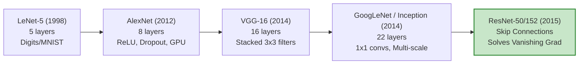
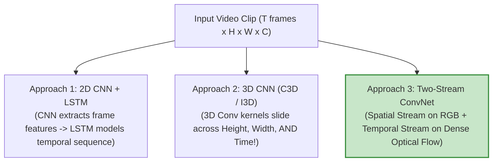

# Unit II — Convolutional Neural Networks (CNN) & Recurrent Neural Networks (RNN)
### 25CSA543A — Deep Learning for Artificial Intelligence

> **Course Level:** Undergraduate / Intermediate Deep Learning  
> **Prerequisites:** Multi-Layer Perceptrons, Backpropagation, Matrix Calculus, Vectorized Forward/Backward Passes  
> **Core Objective:** Master spatial representations in Computer Vision via Convolutional Neural Networks (CNNs), landmark architectures, transfer learning, object detection, face recognition, and neural style transfer; and master temporal/sequential representations via Recurrent Neural Networks (RNNs, LSTMs, GRUs), Encoder-Decoder Seq2Seq models, Attention Mechanisms, Word Embeddings, and real-world audio/video/satellite applications.

---

## Table of Contents
1. [PART A: Convolutional Neural Networks (CNN) & Computer Vision](#part-a-convolutional-neural-networks-cnn--computer-vision)
   - [The Convolution Operator: Mathematics & Multi-Channel Tensor Operations](#1-the-convolution-operator-mathematics--multi-channel-tensor-operations)
   - [Spatial Dimensions: Padding, Strides, and Dilation Formulas](#2-spatial-dimensions-padding-strides-and-dilation-formulas)
   - [Core Inductive Biases: Translation Equivariance & Weight Sharing](#3-core-inductive-biases-translation-equivariance--weight-sharing)
   - [Receptive Field Arithmetic & Growth Through Layers](#4-receptive-field-arithmetic--growth-through-layers)
   - [Pooling Layers: Max Pooling, Average Pooling & Global Average Pooling](#5-pooling-layers-max-pooling-average-pooling--global-average-pooling)
   - [Landmark CNN Architectures: LeNet, AlexNet, VGG, GoogLeNet (Inception), and ResNet](#6-landmark-cnn-architectures-lenet-alexnet-vgg-googlenet-inception-and-resnet)
   - [Transfer Learning & Fine-Tuning Strategies](#7-transfer-learning--fine-tuning-strategies)
   - [Object Detection & Localization: Two-Stage (R-CNN, Fast, Faster) vs. One-Stage (YOLO, SSD)](#8-object-detection--localization-two-stage-r-cnn-fast-faster-vs-one-stage-yolo-ssd)
   - [Face Recognition: Siamese Networks & Triplet Loss Mining](#9-face-recognition-siamese-networks--triplet-loss-mining)
   - [Neural Style Transfer: Gram Matrices & Feature Reconstruction Loss](#10-neural-style-transfer-gram-matrices--feature-reconstruction-loss)
2. [PART B: Recurrent Neural Networks (RNN) & Sequence Modeling](#part-b-recurrent-neural-networks-rnn--sequence-modeling)
   - [The Sequence Modeling Problem & Recurrent Hidden States](#11-the-sequence-modeling-problem--recurrent-hidden-states)
   - [Backpropagation Through Time (BPTT) & The Exploding/Vanishing Gradient Proof](#12-backpropagation-through-time-bptt--the-explodingvanishing-gradient-proof)
   - [Long Short-Term Memory Networks (LSTM): The Constant Error Carousel](#13-long-short-term-memory-networks-lstm-the-constant-error-carousel)
   - [Gated Recurrent Units (GRU): Lightweight Recurrence](#14-gated-recurrent-units-gru-lightweight-recurrence)
   - [Encoder-Decoder (Seq2Seq) Architectures & Information Bottlenecks](#15-encoder-decoder-seq2seq-architectures--information-bottlenecks)
   - [Attention Mechanisms: Bahdanau (Additive), Luong (Multiplicative), and Scaled Dot-Product](#16-attention-mechanisms-bahdanau-additive-luong-multiplicative-and-scaled-dot-product)
   - [Natural Language Processing (NLP) & Word Embeddings: Word2Vec, GloVe, FastText](#17-natural-language-processing-nlp--word-embeddings-word2vec-glove-fasttext)
   - [Domain Applications: Sentinel Satellite Classification, Speech Recognition (CTC Loss), and Video Action Recognition](#18-domain-applications-sentinel-satellite-classification-speech-recognition-ctc-loss-and-video-action-recognition)
3. [Unit II Summary & Comparative Reference Table](#19-unit-ii-summary--comparative-reference-table)

---

# PART A: Convolutional Neural Networks (CNN) & Computer Vision

---

## 1. The Convolution Operator: Mathematics & Multi-Channel Tensor Operations

### 1.1 Why Dense Networks Fail on Images
Feeding a standard high-resolution RGB image ($1000 \times 1000 \times 3 = 3,000,000$ values) into a dense layer with $1,000$ hidden units creates **$3 \times 10^9$ weights (3 billion parameters)**!
- Impractically huge memory footprint.
- Massive overfitting due to parameter redundancy.
- Flattens spatial 2D structure, completely ignoring local neighborhood relationships.

### 1.2 The Discrete 2D Convolution Formula

> [!TIP]
> **Physical Metaphor — The Sliding Stencil Flashlight:**
> Imagine a dark room with a detailed painting (Image $I$). You hold a flashlight with a shaped glass stencil (Kernel $K$). As you slide the flashlight across the canvas, only paint patterns matching your stencil shine brightly (High Feature Activation $Z$). Edges, lines, and textures are illuminated where the stencil matches the painting underneath.

Given a 2D image $I$ and a 2D kernel/filter $K$ of size $k_h \times k_w$:

$$(I * K)(i, j) = \sum_{m=0}^{k_h-1} \sum_{n=0}^{k_w-1} I(i + m, j + n) K(m, n)$$

*(Note: In deep learning frameworks, this cross-correlation operation is conventionally termed "convolution").*

```
INPUT PATCH (3x3)              KERNEL K (3x3)               OUTPUT VALUE
+----+----+----+               +----+----+----+
|  1 |  2 |  0 |               |  1 |  0 | -1 |
+----+----+----+               +----+----+----+
|  0 |  1 |  1 |       *       |  1 |  0 | -1 |      =   (1*1 + 2*0 + 0*-1)
+----+----+----+               +----+----+----+        + (0*1 + 1*0 + 1*-1)
|  2 |  0 |  1 |               |  1 |  0 | -1 |        + (2*1 + 0*0 + 1*-1) = 1 - 1 + 2 - 1 = 1
+----+----+----+               +----+----+----+
```

### 1.3 Multi-Channel 3D Tensor Convolutions
In practice, an input tensor $X \in \mathbb{R}^{C_{\text{in}} \times H_{\text{in}} \times W_{\text{in}}}$ is convolved with $C_{\text{out}}$ distinct 3D filter kernels $\{K^{(k)}\}_{k=1}^{C_{\text{out}}}$, where each kernel has shape $C_{\text{in}} \times k_h \times k_w$:

$$Z(k, i, j) = b_k + \sum_{c=1}^{C_{\text{in}}} \sum_{m=0}^{k_h-1} \sum_{n=0}^{k_w-1} X(c, i + m, j + n) K^{(k)}(c, m, n)$$

```
INPUT TENSOR (Cin x H x W)       FILTER BANK (Cout filters of size Cin x kh x kw)       OUTPUT FEATURE MAPS (Cout x H' x W')
+-----------------------+               +-----------+                                       +-----------------------+
|  Channel 1 (Red)      |    *          | Filter 1  |                       ====>           | Feature Map 1 (Edges) |
|  Channel 2 (Green)    |               +-----------+                                       | Feature Map 2 (Blobs) |
|  Channel 3 (Blue)     |               | Filter 2  |                                       | ...                   |
+-----------------------+               | ...       |                                       | Feature Map Cout      |
                                        +-----------+                                       +-----------------------+
```

---

## 2. Spatial Dimensions: Padding, Strides, and Dilation Formulas

### 2.1 The Spatial Output Size Formula
For an input spatial dimension $N$, filter dimension $F$, padding $P$, stride $S$, and dilation rate $D$:

$$\text{Output Dimension } N_{\text{out}} = \left\lfloor \frac{N + 2P - D(F - 1) - 1}{S} \right\rfloor + 1$$

When dilation $D = 1$ (standard dense convolution):

$$\boxed{N_{\text{out}} = \left\lfloor \frac{N - F + 2P}{S} \right\rfloor + 1}$$

```
PADDING MODES:
1. "Valid" Padding (P = 0):   No zero-padding. Output shrinks: N_out = (N - F)/S + 1.
2. "Same" Padding:            P = (F - 1)/2 (for odd F, S = 1). Output spatial dimensions are preserved: N_out = N.
```

---

## 3. Core Inductive Biases: Translation Equivariance & Weight Sharing

CNNs succeed on images because they hardcode two fundamental physical symmetries of the visual world:

1. **Translation Equivariance:**
   If an input object shifts by $\Delta x$ pixels, its feature map activation shifts by the exact same $\Delta x$ pixels:
   $$f(T_{\Delta x}(I)) = T_{\Delta x}(f(I))$$
   A cat detector kernel learns to identify whiskers regardless of whether the cat is located at the top-left or bottom-right of the frame.

2. **Weight Sharing:**
   The exact same filter weights $K$ are swept across all spatial coordinates $(i, j)$ of the image. This drastically reduces the parameter count and ensures spatial stationarity.

---

## 4. Receptive Field Arithmetic & Growth Through Layers

The **Receptive Field (RF)** of a unit in layer $l$ is the spatial area in the original input image that directly influences its activation value.

### Step-by-Step Receptive Field Growth Formula:
$$RF_l = RF_{l-1} + (k_l - 1) \cdot j_{l-1}$$
Where $j_l = j_{l-1} \cdot s_l$ is the cumulative jump/stride of layer $l$ ($RF_0 = 1, j_0 = 1$).

```
Layer 0 (Input):  RF = 1x1
Layer 1 (3x3, s=1): RF = 1 + (3-1)*1 = 3x3
Layer 2 (3x3, s=1): RF = 3 + (3-1)*1 = 5x5
Layer 3 (3x3, s=1): RF = 5 + (3-1)*1 = 7x7  <-- Two 3x3 layers cover the same RF as one 5x5 layer,
                                                   using 2*(3^2) = 18 weights vs 5^2 = 25 weights!
```

---

## 5. Pooling Layers: Max Pooling, Average Pooling & Global Average Pooling

Pooling provides **translation invariance** (small perturbations in position do not change the pooled value) and reduces spatial dimensions to manage computational load.

```
MAX POOLING (2x2 filter, stride=2):             AVERAGE POOLING (2x2 filter, stride=2):
+----+----+----+----+                           +----+----+----+----+
| 12 | 20 | 30 |  0 |                           | 12 | 20 | 30 |  0 |
+----+----+----+----+   ===> +----+----+        +----+----+----+----+   ===> +-----+-----+
|  8 | 12 |  2 | 14 |        | 20 | 30 |        |  8 | 12 |  2 | 14 |        | 13  | 11.5|
+----+----+----+----+        +----+----+        +----+----+----+----+        +-----+-----+
| 34 | 70 | 37 |  4 |        | 70 | 37 |        | 34 | 70 | 37 |  4 |        | 38.5| 13.5|
+----+----+----+----+        +----+----+        +----+----+----+----+        +-----+-----+
| 12 | 10 | 25 | 12 |                           | 12 | 10 | 25 | 12 |
+----+----+----+----+                           +----+----+----+----+
```

- **Global Average Pooling (GAP):** Averages each entire feature map channel into a single scalar ($C \times H \times W \to C \times 1 \times 1$). Replaces giant fully-connected layers (e.g., in GoogLeNet and ResNet), eliminating 90%+ of model parameters!

---

## 6. Landmark CNN Architectures: LeNet to ResNet



### 6.1 Architecture Comparative Matrix:
| Architecture | Year | Depth | Key Innovation | Total Parameters | Top-5 ImageNet Error |
|:---|:---:|:---:|:---|:---:|:---:|
| **LeNet-5** | 1998 | 5 | First practical Conv + Subsampling + FC network | $60\text{ K}$ | N/A |
| **AlexNet** | 2012 | 8 | ReLU, Dropout ($p=0.5$), Dual-GPU parallelism, Local Response Norm | $60\text{ M}$ | $15.3\%$ |
| **VGG-16** | 2014 | 16 | Homogeneous design; replaced large filters with cascades of $3\times 3$ filters | $138\text{ M}$ | $7.3\%$ |
| **GoogLeNet (Inception v1)** | 2014 | 22 | Multi-branch Inception module with $1\times 1$ conv dimensionality reduction, Global Average Pooling | $7\text{ M}$ | $6.7\%$ |
| **ResNet-50** | 2015 | 50 | Residual identity skip connections ($F(x) + x$), enabling ultra-deep 152+ layer training | $25.6\text{ M}$ | $\mathbf{3.57\%}$ |

---

### 6.2 The Inception Module & $1 \times 1$ Convolutions
Convolving a 192-channel feature map with thirty-two $5\times 5$ filters requires massive computation: $192 \times 32 \times 5 \times 5 \times H \times W \approx 153,600 \cdot HW$ operations!
GoogLeNet places a **$1 \times 1$ convolution bottleneck** ($192 \to 16$ channels) before the $5 \times 5$ convolution, cutting FLOPs by **$90\%$**!

```
                    INCEPTION MODULE WITH DIMENSIONALITY REDUCTION
                                  +-------------------+
                                  | Previous Layer X  |
                                  +-------------------+
                                  /    |        |     \
                                 /     |        |      \
        +-----------------------+      |        |       +-----------------------+
        |   1x1 Convolution     |      |        |       |    3x3 Max Pooling    |
        +-----------------------+      |        |       +-----------------------+
                   |                   |        |                   |
                   |          +---------------+ +---------------+   |
                   |          | 1x1 Conv (Red)| | 1x1 Conv (Red)|   |
                   |          +---------------+ +---------------+   |
                   |                   |                |           |
                   |          +---------------+ +---------------+ +---------------+
                   |          | 3x3 Conv      | | 5x5 Conv      | | 1x1 Conv      |
                   |          +---------------+ +---------------+ +---------------+
                   \                   |                |          /
                    \                  |                |         /
                  +-------------------------------------------------+
                  |          Filter Concatenation Layer             |
                  +-------------------------------------------------+
```

---

### 6.3 The ResNet Residual Block & Gradient Highway

> [!TIP]
> **Physical Metaphor — The Frictionless Express Bypass Tunnel:**
> Imagine a congested 100-story skyscraper with stairs full of friction. Each floor's transformation $\mathcal{F}(x)$ is a noisy room. The identity skip connection is a frictionless express elevator tunnel bypassing the rooms directly. Backpropagating gradients travel down this open shaft at full speed ($+\mathbf{1}$), entirely unimpeded by the deep weight layers.

In ultra-deep networks (>20 layers), training error paradoxically worsens due to gradient shattering/vanishing. ResNet introduces a **Shortcut (Identity) Connection**:

$$y = \mathcal{F}(x, \{W_i\}) + x$$

```
                           RESIDUAL BASIC BLOCK
                   x ----------------------------+ (Identity Skip Connection)
                   |                             |
                   v                             |
          +-----------------+                    |
          |  Weight (Conv)  |                    |
          +-----------------+                    |
                   |                             |
                   v                             |
          +-----------------+                    |
          |      ReLU       |                    |
          +-----------------+                    |
                   |                             |
                   v                             |
          +-----------------+                    |
          |  Weight (Conv)  |                    |
          +-----------------+                    |
                   |                             |
                   v                             v
                   +---------------------------> (+) (Elementwise Addition)
                                                  |
                                                  v
                                                [ ReLU ] ---> Output y = F(x) + x
```

#### Why Skip Connections Solve Vanishing Gradients:
By the Chain Rule, the gradient of the loss $\mathcal{L}$ with respect to layer input $x$ is:
$$\frac{\partial \mathcal{L}}{\partial x} = \frac{\partial \mathcal{L}}{\partial y} \cdot \frac{\partial y}{\partial x} = \frac{\partial \mathcal{L}}{\partial y} \cdot \left( \frac{\partial \mathcal{F}}{\partial x} + \mathbf{1} \right) = \frac{\partial \mathcal{L}}{\partial y} \frac{\partial \mathcal{F}}{\partial x} + \mathbf{\frac{\partial \mathcal{L}}{\partial y}}$$

Even if the learned Jacobian $\frac{\partial \mathcal{F}}{\partial x}$ vanishes to zero, the additive $+ \mathbf{1}$ term acts as a **lossless gradient highway**, propagating the gradient signal $\frac{\partial \mathcal{L}}{\partial y}$ back to early layers without decay!

---

## 7. Transfer Learning & Fine-Tuning Strategies

```
+-------------------------------------------------------------+-----------------------+
|          PRETRAINED BASE (ImageNet Feature Extractor)       |       CUSTOM HEAD     |
|   Conv1 (Edges) -> Conv2 (Textures) -> Conv3 -> Conv4       |   Dense -> Softmax    |
+-------------------------------------------------------------+-----------------------+
```

### Strategy Decision Matrix:
| Target Dataset Size | Domain Similarity to Pretrained Set | Recommended Transfer Learning Strategy |
|:---:|:---:|:---|
| **Small** ($< 1,000$ images) | **High** (Standard object classes) | **Linear Probing:** Freeze entire conv base ($\text{requires\_grad}=\text{False}$); train only the new linear output classifier head. |
| **Small** ($< 1,000$ images) | **Low** (Medical X-rays, Satellite) | **Partial Fine-Tuning:** Freeze early conv layers (generic edges); fine-tune top conv blocks + classifier with low learning rate ($\eta = 10^{-4}$). |
| **Large** ($> 50,000$ images)| **High or Low** | **Full Fine-Tuning:** Initialize all layers with pretrained weights; train entire network end-to-end with learning rate warmup and cosine decay. |

---

## 8. Object Detection & Localization: Two-Stage vs. One-Stage Detectors

```
OBJECT LOCALIZATION (Single Object):     OBJECT DETECTION (Multiple Objects):
Outputs: [p_c, b_x, b_y, b_w, b_h, c]     Outputs: Multiple bounding boxes + class labels
```

```
TWO-STAGE DETECTORS (R-CNN Family: High Accuracy, Slower)
Image ---> [ Region Proposal Network (RPN) ] ---> [ RoI Pooling ] ---> [ Box Classifier + Regressor ]

ONE-STAGE DETECTORS (YOLO / SSD Family: Ultra-Fast Real-Time)
Image ---> [ Deep CNN Backbone + Feature Pyramid ] ---> [ Dense Grid Predictions (All boxes in 1 pass!) ]
```

### 8.1 The R-CNN Evolution
1. **R-CNN (2014):** Uses Selective Search to propose $\sim 2000$ candidate regions $\to$ warps each to $224\times 224$ $\to$ runs full CNN 2000 times per image ($\sim 47\text{ sec/image}$).
2. **Fast R-CNN (2015):** Runs CNN **once** on the entire image $\to$ extracts region features using **RoI (Region of Interest) Pooling** ($\sim 2\text{ sec/image}$).
3. **Faster R-CNN (2015):** Replaces slow Selective Search with a learned neural **Region Proposal Network (RPN)** sharing conv features with the detector ($\sim 0.2\text{ sec/image}$, 5–7 FPS).

---

### 8.2 YOLO (You Only Look Once): Single-Shot Detection
YOLO divides the input image into an $S \times S$ grid (e.g., $7 \times 7$). If the center of an object falls into a grid cell, that cell is responsible for predicting:
- $B$ bounding boxes, each with 5 parameters: $(x, y, w, h, \text{confidence})$
- $C$ conditional class probabilities $P(\text{Class}_i \mid \text{Object})$
- Total output tensor shape: $S \times S \times (B \times 5 + C)$

#### Non-Maximum Suppression (NMS) Algorithm:
1. Discard all predicted bounding boxes with confidence score below threshold (e.g., $0.5$).
2. Select the remaining box with highest confidence score; add to final predictions.
3. Eliminate all remaining overlapping boxes that have Intersection-over-Union $\text{IoU} > \text{threshold}$ (e.g., $0.5$) with the selected box:
   $$\text{IoU} = \frac{\text{Area of Overlap}}{\text{Area of Union}}$$
4. Repeat steps 2–3 until no boxes remain.

---

## 9. Face Recognition: Siamese Networks & Triplet Loss Mining

Face recognition requires **One-Shot Learning**: identifying a person from a single reference photograph without retraining the network.

### 9.1 Siamese Network Distance Metric
A deep CNN maps a face image $x$ into a compact 128-dimensional embedding vector $f(x) \in \mathbb{R}^{128}$ on the unit hypersphere ($\|f(x)\|_2 = 1$). The similarity between faces $x_1, x_2$ is their Euclidean distance:
$$d(x_1, x_2) = \|f(x_1) - f(x_2)\|_2^2$$

---

### 9.2 Triplet Loss Formulation & Mining
Training uses triplets consisting of an **Anchor ($A$)**, a **Positive ($P$)** of the same identity, and a **Negative ($N$)** of a different person:

$$\mathcal{L}(A, P, N) = \max\left( 0, \; \|f(A) - f(P)\|_2^2 - \|f(A) - f(N)\|_2^2 + \alpha \right)$$

Where $\alpha > 0$ is a fixed margin (e.g., $\alpha = 0.2$).

```
                      TRIPLET MINING CATEGORIES IN EMBEDDING SPACE
  Anchor (A)
      *-------- d(A,P) --------* Positive (P)
      |
      |   (d(A,N) > d(A,P) + alpha)
      +---------------------------------> * Easy Negative (Loss = 0)
      |
      |   (d(A,P) < d(A,N) < d(A,P) + alpha)
      +-------------------------> * Semi-Hard Negative (Crucial for effective training!)
      |
      |   (d(A,N) < d(A,P))
      +---> * Hard Negative (High Loss)
```

- **Easy Triplets:** $d(A, P) + \alpha < d(A, N)$ $\implies \mathcal{L} = 0$. Provides no gradient updates.
- **Semi-Hard Triplets:** $d(A, P) < d(A, N) < d(A, P) + \alpha$. Lies inside the margin; stabilizes training and yields fast convergence.
- **Hard Triplets:** $d(A, N) < d(A, P)$. Violates the ranking completely; can lead to unstable training if oversampled early.

---

## 10. Neural Style Transfer: Gram Matrices & Feature Loss

Invented by Gatys, Ecker, and Bethge (2015), Neural Style Transfer synthesizes an image $\vec{x}$ that combines the semantic **Content ($C$)** of a photo with the artistic **Style ($S$)** of a painting.

```
Content Image (C) ---\
                      +---> Synthesized Image (x) [Optimized via L-BFGS/Adam on Image Pixels!]
Style Image (S)   ---/
```

### 10.1 Mathematical Loss Formulations:
1. **Content Loss at Layer $l$:**
   $$\mathcal{L}_{\text{content}}(C, x) = \frac{1}{2} \sum_{i, j} (F_{ij}^l(x) - P_{ij}^l(C))^2$$
   Where $F^l(x)$ and $P^l(C)$ are the feature activation maps of layer $l$ in VGG-19.

2. **Style Loss via Gram Matrix:**
   The **Gram Matrix** $G^l \in \mathbb{R}^{C_l \times C_l}$ captures the cross-channel feature correlations (texture statistics independent of spatial coordinates):
   $$G_{ik}^l = \sum_{j=1}^{H_l \times W_l} F_{ij}^l F_{kj}^l$$
   $$\mathcal{L}_{\text{style}}(S, x) = \sum_{l \in \text{Layers}} w_l \frac{1}{4 N_l^2 M_l^2} \sum_{i, k} (G_{ik}^l(x) - A_{ik}^l(S))^2$$

3. **Total Objective Function:**
   $$\mathcal{L}_{\text{total}}(x) = \alpha \mathcal{L}_{\text{content}}(C, x) + \beta \mathcal{L}_{\text{style}}(S, x) + \gamma \mathcal{L}_{\text{TV}}(x)$$
   *(Where $\mathcal{L}_{\text{TV}}$ is Total Variation denoising loss for spatial coherence).*

---

# PART B: Recurrent Neural Networks (RNN) & Sequence Modeling

---

## 11. The Sequence Modeling Problem & Recurrent Hidden States

Standard feedforward networks cannot handle temporal sequences because:
1. Inputs and outputs can have **variable lengths** (e.g., sentences with 5 vs. 50 words).
2. They do not share parameters across different time steps.
3. They have no **memory** of preceding context.

### 11.1 The Recurrent State Update Equations
At each discrete time step $t \in \{1, 2, \dots, T\}$:

$$h_t = \tanh(W_{hh} h_{t-1} + W_{xh} x_t + b_h)$$
$$\hat{y}_t = \text{softmax}(W_{hy} h_t + b_y)$$

```
                               UNROLLED RECURRENT NETWORK
   L_1                     L_2                     L_3                     L_T
    ^                       ^                       ^                       ^
    |                       |                       |                       |
  y_hat_1                 y_hat_2                 y_hat_3                 y_hat_T
    ^                       ^                       ^                       ^
    | (Why)                 | (Why)                 | (Why)                 | (Why)
  +----+     (Whh)        +----+     (Whh)        +----+     (Whh)        +----+
  | h1 | ---------------> | h2 | ---------------> | h3 | ------...------> | hT |
  +----+                  +----+                  +----+                  +----+
    ^                       ^                       ^                       ^
    | (Wxh)                 | (Wxh)                 | (Wxh)                 | (Wxh)
    x1                      x2                      x3                      xT
```

---

## 12. Backpropagation Through Time (BPTT) & The Gradient Proof

> [!TIP]
> **Physical Metaphor — The 50-Person Whispering Line:**
> Imagine a game of telephone across 50 people standing in a line. In vanilla RNNs, each person whispers the error gradient backwards through a lossy multiplier ($W_{hh}^T \cdot \text{diag}(1-\tanh^2)$). If the multiplier is $0.9$, by person 50 the whisper volume is $0.9^{50} \approx 0.005$ (Vanishing). If the multiplier is $1.2$, person 50 gets their eardrum ruptured at $1.2^{50} \approx 9100$ (Exploding).

The total sequence loss is the sum of losses across time steps: $\mathcal{L} = \sum_{t=1}^T \mathcal{L}_t$.

### Mathematical Proof of Vanishing/Exploding Gradients in RNNs:
By the multivariate chain rule, the gradient of loss at time $T$ with respect to weight matrix $W_{hh}$ requires backpropagating through all intermediate hidden states:

$$\frac{\partial \mathcal{L}_T}{\partial W_{hh}} = \sum_{k=1}^T \frac{\partial \mathcal{L}_T}{\partial h_T} \frac{\partial h_T}{\partial h_k} \frac{\partial h_k}{\partial W_{hh}}$$

Where the temporal Jacobian product is:
$$\frac{\partial h_T}{\partial h_k} = \prod_{j=k+1}^T \frac{\partial h_j}{\partial h_{j-1}} = \prod_{j=k+1}^T \text{diag}(1 - \tanh^2(z_j)) \, W_{hh}^T$$

```
Let gamma be the largest eigenvalue of W_hh:
1. If gamma < 1 (and |1 - tanh^2| <= 1):  The product (gamma)^(T-k) decays exponentially to 0 as T-k grows!
   ===> VANISHING GRADIENTS: Early time steps receive ZERO gradient updates (Cannot learn long-term dependencies!).
2. If gamma > 1:                          The product (gamma)^(T-k) grows exponentially to infinity!
   ===> EXPLODING GRADIENTS: Weights blow up to NaN / Inf (Model diverges!).
```

#### Mitigations:
- **For Exploding Gradients:** **Gradient Clipping** ($\text{if } \|g\|_2 > \tau \implies g \leftarrow g \cdot \frac{\tau}{\|g\|_2}$).
- **For Vanishing Gradients:** Replace vanilla RNN cells with **LSTM** or **GRU** gating architectures!

---

## 13. Long Short-Term Memory Networks (LSTM): The Constant Error Carousel

> [!TIP]
> **Physical Metaphor — The Factory Assembly Conveyor Belt:**
> The LSTM Cell State $C_t$ is an uninterrupted factory conveyor belt. Three pneumatic robotic arms control the flow:
> 1. **Forget Gate ($f_t$):** A vacuum shredder that selectively sucks away obsolete parts.
> 2. **Input Gate ($i_t$):** A robotic stamper that welds brand-new components onto the belt.
> 3. **Output Gate ($o_t$):** An inspection scanner that reads what's on the belt and displays it on the factory monitor ($h_t$).

Introduced by Hochreiter and Schmidhuber (1997), the **LSTM** maintains a dedicated **Cell State ($C_t$)** that acts as an additive gradient highway, eliminating vanishing gradients over hundreds of time steps.

```
                                  LSTM CELL ARCHITECTURE
                        +---------------------------------------+
   Cell State C_{t-1} --|----+-------------------------(+)----->|--> C_t (Cell State)
                        |    |                          ^       |
                        |    v                          |       |
                        |   (x) Forget Gate            (x)      |
                        |    ^                          ^       |
                        |    |                          |       |
                        |  [ f_t ]             [ i_t ] [ C~_t ] |
                        |    ^                   ^       ^      |
                        |    |                   |       |      |
                        |  [sigma]             [sigma] [tanh]   |
                        |    ^                   ^       ^      |
                        |    +---------+---------+-------+      |
                        |              |                 |      |
                        |              |        [ o_t ]  |      |
                        |              |          ^      |      |
                        |              |       [sigma]   v      |
                        |              |          ^   [tanh]    |
                        |              |          |      |      |
   Hidden State h_{t-1}-|--------------+          +-----(x)---->|--> h_t (Hidden State)
   Input x_t -----------+                                       |
                        +---------------------------------------+
```

### Complete LSTM Gate Equations:
1. **Forget Gate ($f_t$):** Decides what information to discard from cell state:
   $$f_t = \sigma(W_f [h_{t-1}, x_t] + b_f)$$
2. **Input Gate ($i_t$) & Candidate Cell ($\tilde{C}_t$):** Decides what new information to store:
   $$i_t = \sigma(W_i [h_{t-1}, x_t] + b_i)$$
   $$\tilde{C}_t = \tanh(W_c [h_{t-1}, x_t] + b_c)$$
3. **Cell State Update ($C_t$):** Pure linear combination (Additive gradient highway):
   $$\mathbf{C_t = f_t \odot C_{t-1} + i_t \odot \tilde{C}_t}$$
4. **Output Gate ($o_t$) & Hidden State ($h_t$):**
   $$o_t = \sigma(W_o [h_{t-1}, x_t] + b_o)$$
   $$\mathbf{h_t = o_t \odot \tanh(C_t)}$$

---

## 14. Gated Recurrent Units (GRU): Lightweight Recurrence

Introduced by Cho et al. (2014), the **GRU** merges cell state and hidden state, using only **two gates**:

```
GRU GATES:
1. Reset Gate (r_t):   r_t = sigma(W_r [h_{t-1}, x_t] + b_r)   --> Controls how much past memory to forget
2. Update Gate (z_t):  z_t = sigma(W_z [h_{t-1}, x_t] + b_z)   --> Acts simultaneously as forget & input gate!
3. Candidate State:    h~_t = tanh(W_h [r_t (*) h_{t-1}, x_t] + b_h)
4. Hidden State:       h_t = (1 - z_t) (*) h_{t-1} + z_t (*) h~_t
```

### LSTM vs. GRU Comparison:
| Aspect | LSTM | GRU |
|:---|:---|:---|
| **Number of Gates** | 3 ($f_t, i_t, o_t$) | 2 ($r_t, z_t$) |
| **Internal States** | 2 ($C_t$ Cell state, $h_t$ Hidden state) | 1 ($h_t$ Hidden state) |
| **Parameters** | $4 \times (d_h^2 + d_h d_x)$ | $3 \times (d_h^2 + d_h d_x)$ (**$25\%$ fewer parameters!**) |
| **Training Speed** | Slightly slower; needs more data | Faster training; superior on small datasets |

---

## 15. Encoder-Decoder (Seq2Seq) Architectures & Bottlenecks

In tasks like Neural Machine Translation (e.g., English to German), input sequence length $T_x$ differs from output sequence length $T_y$.

```
ENCODER (Processes Input Sentence)               DECODER (Generates Translated Sentence)
"The" -> "cat" -> "sat"                          "Die" -> "Katze" -> "saß"
 (x1)     (x2)     (x3)                           (y1)      (y2)       (y3)
  |        |        |                              ^         ^          ^
+----+   +----+   +----+                         +----+    +----+     +----+
| h1 |-->| h2 |-->| h3 |---> [ CONTEXT VECTOR c ]->| s1 |--->| s2 |--->  | s3 |
+----+   +----+   +----+      (Fixed Bottleneck!) +----+    +----+     +----+
```

### The Bottleneck Problem:
Compressing a 100-word sentence into a single fixed-size vector $c \in \mathbb{R}^{512}$ causes severe **information loss**, causing translation accuracy to degrade sharply on long sentences ($T_x > 20$).

---

## 16. Attention Mechanisms: Additive, Multiplicative & Scaled Dot-Product

> [!TIP]
> **Physical Metaphor — The Dynamic Theater Spotlight:**
> Instead of summarizing an entire 2-hour play into a single sentence on an index card (the Seq2Seq bottleneck), Attention is an automated theater spotlight. When the translator says a German word, the spotlight instantly swivels and focuses all illumination onto the specific actor on stage (source word) who spoke the corresponding English phrase.

Instead of forcing the encoder to compress everything into one vector, **Attention** allows the decoder to dynamically look back at all encoder hidden states $\{h_1, h_2, \dots, h_{T_x}\}$ at every output decoding step $t$.

```
                               ATTENTION COMPUTATIONAL GRAPH
  Encoder States:   h_1        h_2        h_3        h_{Tx}
                     \          |          /           /
                      \         |         /           /
                       v        v        v           v
  Alignment Scores:   [ e_1 ]  [ e_2 ]  [ e_3 ] ... [ e_{Tx} ] <--- Decoder State s_{t-1}
                         \        |        /           /
                          v       v       v           v
  Softmax Attention:  [ alpha_1, alpha_2, alpha_3, ... alpha_{Tx} ]  (Weights sum to 1.0)
                         \        |        /           /
                          v       v       v           v
  Dynamic Context:      c_t = sum(alpha_i * h_i) (Weighted combination of encoder states!)
                                  |
                                  v
                        [ Decoder Output State s_t ] ---> Predict y_t
```

### Attention Variant Comparison:
1. **Bahdanau (Additive) Attention (2014):**
   $$e_{ij} = v_a^T \tanh(W_a s_{i-1} + U_a h_j)$$
2. **Luong (Multiplicative) Attention (2015):**
   $$e_{ij} = s_i^T W_a h_j$$
3. **Vaswani Scaled Dot-Product Attention (2017 - Transformer Foundation):**
   $$\text{Attention}(Q, K, V) = \text{softmax}\left( \frac{Q K^T}{\sqrt{d_k}} \right) V$$

> [!NOTE]
> **Why divide by $\sqrt{d_k}$?** For large embedding dimensions $d_k$, dot products $q \cdot k$ grow large in magnitude, pushing the Softmax function into saturation regions with microscopic gradients. Scaling by $\frac{1}{\sqrt{d_k}}$ preserves unit variance.

---

## 17. Natural Language Processing (NLP) & Word Embeddings

### 17.1 Evolution of Word Representations
1. **One-Hot Encoding:** Vectors of vocabulary size $V \approx 50,000$. Sparse, memory-inefficient, and orthogonal: $\text{sim}(\text{"cat"}, \text{"dog"}) = 0$ (No semantic relationship!).
2. **Dense Word Embeddings (Word2Vec, GloVe):** Continuous low-dimensional vectors ($d \in [100, 300]$) where semantically similar words cluster together:
   $$\vec{v}_{\text{King}} - \vec{v}_{\text{Man}} + \vec{v}_{\text{Woman}} \approx \vec{v}_{\text{Queen}}$$

---

### 17.2 Word2Vec Architectures (Mikolov et al., 2013)

```
CBOW (Continuous Bag-of-Words):                 SKIP-GRAM:
Predicts TARGET word from CONTEXT words.        Predicts CONTEXT words given TARGET word.
(Faster training, good for frequent words)      (Better for small datasets & rare words)

   Context: "The [?] sat on"                       Target: "[cat]"
             \     /                                  /       \
              v   v                                  v         v
         Target: "cat"                     Context: "The", "sat", "on"
```

#### Negative Sampling Objective:
Instead of computing costly softmax over the entire vocabulary $V$, Negative Sampling converts multi-class classification into binary logistic regression with $K$ randomly sampled negative (noise) words:

$$\mathcal{L}_{\text{NS}} = \log \sigma(v'_{w_O}{}^T v_{w_I}) + \sum_{i=1}^K \mathbb{E}_{w_i \sim P_n(w)} \left[ \log \sigma(-v'_{w_i}{}^T v_{w_I}) \right]$$

---

### 17.3 GloVe & FastText Comparison
- **GloVe (Pennington et al., 2014):** Fits log-bilinear model to global word co-occurrence matrix $X$:
  $$w_i^T \tilde{w}_j + b_i + \tilde{b}_j = \log(X_{ij})$$
- **FastText (Bojanowski et al., 2017):** Represents each word as a bag of character $n$-grams (e.g., `<wh`, `whe`, `her`, `ere`, `re>`). Can construct embeddings for **Out-Of-Vocabulary (OOV)** words and typos!

---

## 18. Domain Applications: Sentinel, Speech & Action Recognition

### 18.1 Sentinel / Satellite Image Classification
- **Multispectral Bands:** Sentinel-2 captures 13 spectral bands (RGB, Red Edge, Near-Infrared / NIR, Short-Wave Infrared / SWIR).
- **Normalized Difference Vegetation Index (NDVI):**
  $$\text{NDVI} = \frac{\text{NIR} - \text{Red}}{\text{NIR} + \text{Red}}$$
- **U-Net / DeepLab Segmentation:** Multi-spectral CNN architectures classify land-use, crop health, urban sprawl, and deforestation.

---

### 18.2 Speech Recognition: Audio to Text via CTC Loss
1. **Acoustic Preprocessing:** Raw 1D audio waveform $\to$ Short-Time Fourier Transform (STFT) $\to$ Mel-Spectrogram (2D time-frequency image).
2. **Acoustic RNN Model:** Bidirectional LSTM processes spectrogram frames.
3. **Connectionist Temporal Classification (CTC) Loss:** Solves variable audio-to-text alignment by inserting blank tokens $\epsilon$ and collapsing duplicate paths:
   $$\text{"c-c-a-a-t"} \to \text{"cat"}, \qquad \text{"c-\epsilon-a-t"} \to \text{"cat"}$$

---

### 18.3 Video Action Recognition
Videos contain both **Spatial Appearance** (what objects are present) and **Temporal Motion** (how objects move over time).



---

## 19. Unit II Summary & Comparative Reference Table

| Technology / Architecture | Core Domain | Key Mechanism / Formula | Main Advantage | Primary Limitation |
|:---|:---:|:---|:---|:---|
| **CNN Convolution** | Vision | $(I * K)(i, j) = \sum I(i+m, j+n) K(m,n)$ | Translation equivariance, parameter sharing | Weak on non-grid geometric graph data |
| **ResNet** | Vision | $y = \mathcal{F}(x) + x$ | Eliminates vanishing gradients via skip highways | High memory during training |
| **YOLO** | Detection | Single-pass grid regression + NMS | Ultra-fast real-time inference (60+ FPS) | Struggles with clusters of tiny objects |
| **Triplet Loss** | Face ID | $\max(0, \|f(A)-f(P)\|^2 - \|f(A)-f(N)\|^2 + \alpha)$ | Learns continuous metric embeddings | Requires careful semi-hard triplet mining |
| **LSTM** | Sequences | $C_t = f_t \odot C_{t-1} + i_t \odot \tilde{C}_t$ | Additive cell state preserves long-term memory | Slower sequential execution (Cannot parallelize) |
| **Attention** | Seq2Seq | $\text{softmax}(QK^T / \sqrt{d_k}) V$ | Eliminates fixed-vector information bottleneck | $\mathcal{O}(N^2)$ quadratic memory complexity |
| **FastText** | NLP | Subword character $n$-grams | Solves Out-Of-Vocabulary (OOV) typos | Larger model file size than Word2Vec |