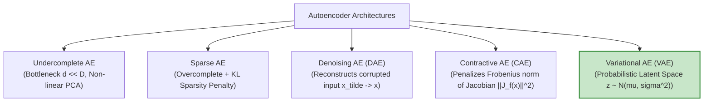
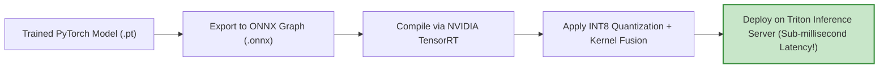

# Unit III — Advanced Deep Learning: Generative Models, Reinforcement Learning & Deployment
### 25CSA543A — Deep Learning for Artificial Intelligence

> **Course Level:** Undergraduate / Advanced Deep Learning  
> **Prerequisites:** Convolutional Networks, Sequence Models, Matrix Calculus, Probability Theory & Expectation  
> **Core Objective:** Master generative modeling (Energy-Based RBMs, Deep Belief Networks, Denoising/Contractive Autoencoders, Variational Autoencoders, GANs, WGAN), Deep Reinforcement Learning (MDPs, Bellman Optimality, Deep Q-Networks, Target Networks, Experience Replay), advanced normalization/regularization techniques, and production deployment pipelines in PyTorch and TensorFlow (ONNX, Quantization, Pruning, Distillation).

---

## Table of Contents
1. [Generative vs. Discriminative Modeling Paradigms](#1-generative-vs-discriminative-modeling-paradigms)
   - [Joint Probability $P(x, y)$ vs. Conditional Probability $P(y \mid x)$](#joint-probability-px-y-vs-conditional-probability-py-mid-x)
   - [Energy-Based Models & The Boltzmann Distribution](#energy-based-models--the-boltzmann-distribution)
2. [Restricted Boltzmann Machines (RBM)](#2-restricted-boltzmann-machines-rbm)
   - [Bipartite Architecture & Conditional Independence](#bipartite-architecture--conditional-independence)
   - [Energy Function & Probabilistic Activations](#energy-function--probabilistic-activations)
   - [Contrastive Divergence ($CD_k$) & Gibbs Sampling](#contrastive-divergence-cd_k--gibbs-sampling)
3. [Deep Belief Networks (DBN)](#3-deep-belief-networks-dbn)
   - [Stacking RBMs & Greedy Layer-Wise Unsupervised Pre-training](#stacking-rbms--greedy-layer-wise-unsupervised-pre-training)
   - [Hybrid Directed/Undirected Architecture & Fine-Tuning](#hybrid-directedundirected-architecture--fine-tuning)
4. [Autoencoders: Deterministic Latent Representations](#4-autoencoders-deterministic-latent-representations)
   - [Undercomplete Autoencoders vs. PCA](#undercomplete-autoencoders-vs-pca)
   - [Sparse Autoencoders (KL Divergence Sparsity Penalty)](#sparse-autoencoders-kl-divergence-sparsity-penalty)
   - [Denoising Autoencoders (DAE) & Manifold Learning](#denoising-autoencoders-dae--manifold-learning)
   - [Contractive Autoencoders (CAE) & The Frobenius Jacobian Penalty](#contractive-autoencoders-cae--the-frobenius-jacobian-penalty)
5. [Variational Autoencoders (VAE): Probabilistic Generative Models](#5-variational-autoencoders-vae-probabilistic-generative-models)
   - [Why Standard Autoencoders Cannot Generate Data](#why-standard-autoencoders-cannot-generate-data)
   - [Latent Variables & The Evidence Lower Bound (ELBO) Derivation](#latent-variables--the-evidence-lower-bound-elbo-derivation)
   - [The Reparameterization Trick ($z = \mu + \sigma \odot \epsilon$)](#the-reparameterization-trick-z--mu--sigma-odot-epsilon)
   - [Gaussian KL Divergence Analytical Closed Form](#gaussian-kl-divergence-analytical-closed-form)
   - [Caveats: Blurry Reconstructions & Posterior Collapse](#caveats-blurry-reconstructions--posterior-collapse)
6. [Deep Reinforcement Learning & Deep Q-Networks (DQN)](#6-deep-reinforcement-learning--deep-q-networks-dqn)
   - [Markov Decision Processes (MDP): State, Action, Transition, Reward, Discount](#markov-decision-processes-mdp-state-action-transition-reward-discount)
   - [The Bellman Optimality Equation for $Q^*(s, a)$](#the-bellman-optimality-equation-for-qs-a)
   - [Deep Q-Networks (DQN) Formulation & Loss](#deep-q-networks-dqn-formulation--loss)
   - [Stability Breakthroughs: Experience Replay & Target Networks](#stability-breakthroughs-experience-replay--target-networks)
   - [Double DQN & Dueling DQN Architectures](#double-dqn--dueling-dqn-architectures)
7. [Generative Adversarial Networks (GANs)](#7-generative-adversarial-networks-gans)
   - [The Minimax Two-Player Game Formulation](#the-minimax-two-player-game-formulation)
   - [Mathematical Derivation: Optimal Discriminator $D^*(x)$ & Jensen-Shannon Divergence](#mathematical-derivation-optimal-discriminator-dx--jensen-shannon-divergence)
   - [The Vanishing Gradient Trap & Non-Saturating Loss Heuristic](#the-vanishing-gradient-trap--non-saturating-loss-heuristic)
   - [Deep Convolutional GAN (DCGAN) Architectural Guidelines](#deep-convolutional-gan-dcgan-architectural-guidelines)
   - [Mode Collapse & Wasserstein GAN with Gradient Penalty (WGAN-GP)](#mode-collapse--wasserstein-gan-with-gradient-penalty-wgan-gp)
8. [Advanced Training Challenges, Normalization & Regularization](#8-advanced-training-challenges-normalization--regularization)
   - [Internal Covariate Shift Debate](#internal-covariate-shift-debate)
   - [Comparative Normalization Analysis: Batch Norm vs. Layer Norm vs. Instance Norm vs. Group Norm](#comparative-normalization-analysis-batch-norm-vs-layer-norm-vs-instance-norm-vs-group-norm)
   - [Advanced Data Augmentation: Mixup, CutMix, and RandAugment](#advanced-data-augmentation-mixup-cutmix-and-randaugment)
9. [Production Model Optimization & Deployment Pipelines](#9-production-model-optimization--deployment-pipelines)
   - [Exporting Formats: ONNX, TorchScript, TF SavedModel, TFLite](#exporting-formats-onnx-torchscript-tf-savedmodel-tflite)
   - [Post-Training Quantization (PTQ) vs. Quantization-Aware Training (QAT)](#post-training-quantization-ptq-vs-quantization-aware-training-qat)
   - [Network Pruning & Knowledge Distillation (Teacher-Student)](#network-pruning--knowledge-distillation-teacher-student)
10. [Unit III Summary & Reference Matrix](#10-unit-iii-summary--reference-matrix)

---

## 1. Generative vs. Discriminative Modeling Paradigms

```
DISCRIMINATIVE PARADIGM:
Input Data (x) -------------> [ Model learns decision boundary P(y|x) ] -------------> Class Label (y)
                              (Focuses ONLY on differences between classes)

GENERATIVE PARADIGM:
Class Label / Noise (z) ----> [ Model learns true distribution P(x|y) or P(x) ] ----> New Synthetic Sample (x)
                              (Understands complete structure of the data!)
```

### 1.1 Joint Probability vs. Conditional Probability
- **Discriminative Models:** Model the posterior conditional probability $P(y \mid x)$ directly. Examples: Logistic Regression, SVM, ResNet, YOLO.
- **Generative Models:** Model the joint distribution $P(x, y) = P(x \mid y)P(y)$ or the unsupervised data distribution $P(x) = \int P(x, z) dz$. Examples: Naive Bayes, GMM, RBM, VAE, GAN, Diffusion.

### 1.2 Energy-Based Models (EBM)
An Energy-Based Model defines a probability distribution over states $x$ via an **Energy Function** $E(x) \in \mathbb{R}$, where lower energy corresponds to higher probability:

$$P(x) = \frac{e^{-E(x)}}{Z}, \qquad Z = \int e^{-E(x)} dx \quad \text{(Partition Function)}$$

---

## 2. Restricted Boltzmann Machines (RBM)

An **RBM** is a two-layer, bipartite undirected graphical model consisting of a **Visible Layer** $v \in \{0, 1\}^D$ and a **Hidden Layer** $h \in \{0, 1\}^F$, with symmetric weights $W \in \mathbb{R}^{D \times F}$ and **no intra-layer connections**.

```
                           RESTRICTED BOLTZMANN MACHINE (RBM)
             Hidden Layer (h):     ( h_1 )       ( h_2 )       ( h_3 )
                                      \     \   /     / \     /   /
                                       \     \ /     /   \   /   /  (Symmetric Weights W)
                                        \     X     /     \ X   /
                                         \   / \   /       / \ /
             Visible Layer (v):    ( v_1 )       ( v_2 )       ( v_3 )       ( v_4 )
             (Input Data)
```

### 2.1 Energy Function & Conditional Independence
The energy of a joint configuration $(v, h)$ is:

$$E(v, h) = - a^T v - b^T h - v^T W h = - \sum_{i=1}^D a_i v_i - \sum_{j=1}^F b_j h_j - \sum_{i=1}^D \sum_{j=1}^F v_i W_{ij} h_j$$

Because there are no connections between units within the same layer, the hidden units are **conditionally independent** given the visible layer, and vice versa:

$$P(h_j = 1 \mid v) = \sigma\left( b_j + \sum_{i=1}^D v_i W_{ij} \right) = \sigma(b_j + W_{\cdot j}^T v)$$
$$P(v_i = 1 \mid h) = \sigma\left( a_i + \sum_{j=1}^F W_{ij} h_j \right) = \sigma(a_i + W_{i \cdot} h)$$

---

### 2.2 Contrastive Divergence ($CD_k$) & Gibbs Sampling
Computing the exact gradient of the log-likelihood $\log P(v)$ requires summing over all $2^D$ configurations of $Z$, which is computationally intractable ($\mathcal{O}(2^D)$).

Geoffrey Hinton's **Contrastive Divergence ($CD_k$)** approximates the gradient using $k$-step Gibbs sampling (typically $k=1$):

```
                        1-STEP CONTRASTIVE DIVERGENCE (CD-1)
  v_0 (Data) ---> Sample h_0 ~ P(h|v_0) ---> Reconstruct v_1 ~ P(v|h_0) ---> Sample h_1 ~ P(h|v_1)
  \__________________________________/       \____________________________________________/
          Positive Phase (Data)                            Negative Phase (Model)
```

#### Weight Update Equation:
$$\Delta W_{ij} = \eta \left( \langle v_i^{(0)} h_j^{(0)} \rangle_{\text{data}} - \langle v_i^{(k)} h_j^{(k)} \rangle_{\text{model}} \right)$$

---

## 3. Deep Belief Networks (DBN)

A **Deep Belief Network (DBN)** (Hinton et al., 2006) stacks multiple RBMs hierarchically:
- The top two layers form an **undirected RBM associative memory**.
- All lower layers form a **directed top-down generative model**.

```
                               DEEP BELIEF NETWORK (DBN)
                       +---------------------------------------+
                       | Layer 3 (Hidden 3) <---> Layer 2 (H2) |  (Top: Undirected RBM)
                       +---------------------------------------+
                                           |
                                           v  (Directed Generative Connections)
                               +-----------------------+
                               |   Layer 1 (Hidden 1)  |
                               +-----------------------+
                                           |
                                           v
                               +-----------------------+
                               |     Visible Layer     |
                               +-----------------------+
```

### 3.1 Greedy Layer-Wise Unsupervised Pre-training
1. Train RBM 1 on raw data $v$ to learn hidden features $h^{(1)}$.
2. Freeze $W^{(1)}$. Use the activations $P(h^{(1)} \mid v)$ as the visible input data to train RBM 2 to obtain $h^{(2)}$.
3. Repeat layer-by-layer up to layer $L$.
4. **Fine-Tuning:** Unroll the entire stack into a standard feedforward neural network and fine-tune all weights end-to-end with Backpropagation on labeled data.

---

## 4. Autoencoders: Deterministic Latent Representations

An **Autoencoder** is an unsupervised neural network trained to reconstruct its input through a low-dimensional bottleneck latent code $z$:

```
Input x in R^D ---> [ ENCODER: z = f_theta(x) ] ---> Latent Bottleneck z in R^d ---> [ DECODER: x_hat = g_phi(z) ] ---> Output x_hat in R^D
                                                     (d << D: Dimensionality Reduction)
```

$$\mathcal{L}_{\text{reconstruction}}(x, \hat{x}) = \|x - \hat{x}\|_2^2 \quad \text{(MSE)} \quad \text{or} \quad - \sum [x_i \log \hat{x}_i + (1 - x_i) \log(1 - \hat{x}_i)] \quad \text{(BCE)}$$

---

### 4.1 Autoencoder Taxonomy



1. **Undercomplete Autoencoder:** When bottleneck dimension $d < D$ with linear activations, the learned latent space spans the exact same subspace as **Principal Component Analysis (PCA)**. With non-linear activations, it learns curved **non-linear manifolds**.
2. **Sparse Autoencoder:** Allows an overcomplete hidden layer ($d > D$) but penalizes active neurons using KL divergence against a low target activation $\rho \approx 0.05$:
   $$\mathcal{L}_{\text{sparse}} = \mathcal{L}_{\text{recon}} + \beta \sum_{j=1}^d D_{\text{KL}}(\rho \,\|\, \hat{\rho}_j), \qquad \hat{\rho}_j = \frac{1}{m} \sum_{i=1}^m a_j(x^{(i)})$$
3. **Denoising Autoencoder (DAE):** Adds artificial noise to input ($\tilde{x} \sim q(\tilde{x} \mid x)$) and trains the network to output clean $x$. This forces the model to learn the orthogonal projection vector field returning to the data manifold.
4. **Contractive Autoencoder (CAE):** Enforces local invariance by penalizing the sensitivity (Jacobian) of hidden activations to input variations:
   $$\mathcal{L}_{\text{CAE}} = \mathcal{L}_{\text{recon}} + \lambda \|J_f(x)\|_F^2 = \mathcal{L}_{\text{recon}} + \lambda \sum_{i, j} \left( \frac{\partial h_i}{\partial x_j} \right)^2$$

---

## 5. Variational Autoencoders (VAE): Probabilistic Generative Models

### 5.1 Why Standard Autoencoders Fail at Generation
In standard autoencoders, the latent space $z$ contains discrete clusters with large empty gaps. If you pick a random point from an empty gap and pass it to the decoder, it generates garbled nonsense.

```
STANDARD AUTOENCODER (Discontinuous Latent Space):      VARIATIONAL AUTOENCODER (Continuous, Smooth Space):
  z2 ^                                                    z2 ^
     |   [ Cat Cluster ]                                     |       (All classes map to smooth,
     |         \                                             |        overlapping Gaussian distributions
     |          \  EMPTY GAP! (Garbage generated!)           |        centered at N(0, I)!)
     |           \                                           |       .---.     .---.
     |       [ Dog Cluster ]                                 |      ( Cat )---( Dog )
     +-----------------------------> z1                      +-----------------------------> z1
```

---

### 5.2 Evidence Lower Bound (ELBO) Derivation
The VAE models data $x$ as generated by a latent variable $z \sim p(z) = \mathcal{N}(0, I)$.
The true posterior $p(z \mid x) = \frac{p(x \mid z)p(z)}{p(x)}$ is intractable. We approximate it with a variational neural encoder $q_\phi(z \mid x) = \mathcal{N}(\mu_\phi(x), \Sigma_\phi(x))$.

#### Derivation of ELBO from True Data Log-Likelihood:
$$\log p(x) = \mathbb{E}_{z \sim q_\phi(z \mid x)} \left[ \log \frac{p(x, z)}{q_\phi(z \mid x)} \right] + D_{\text{KL}}(q_\phi(z \mid x) \,\|\, p(z \mid x))$$

Since KL divergence is strictly non-negative ($D_{\text{KL}} \ge 0$):

$$\log p(x) \ge \text{ELBO}(\theta, \phi; x) = \underbrace{\mathbb{E}_{z \sim q_\phi(z \mid x)}[\log p_\theta(x \mid z)]}_{\text{Reconstruction Term}} - \underbrace{D_{\text{KL}}(q_\phi(z \mid x) \,\|\, p(z))}_{\text{Regularization Term (Prior Matching)}}$$

---

### 5.3 The Reparameterization Trick
Backpropagation cannot compute gradients through stochastic sampling $z \sim \mathcal{N}(\mu, \sigma^2)$.
The **Reparameterization Trick** factors the stochasticity out into an independent standard normal noise variable $\epsilon \sim \mathcal{N}(0, I)$:

$$\mathbf{z = \mu_\phi(x) + \sigma_\phi(x) \odot \epsilon} \qquad \text{where } \epsilon \sim \mathcal{N}(0, I)$$

```
WITHOUT REPARAMETERIZATION (Backprop Blocked):      WITH REPARAMETERIZATION TRICK (Differentiable!):
  mu ----\                                          mu -----------\
          ---> [ Random Sample z ~ N(mu, sigma) ]                  ---> [ z = mu + sigma (*) epsilon ] ---> Decoder
  sigma --/         (CANNOT DIFFERENTIATE!)         sigma -- (*) -/
                                                              ^
                                          epsilon ~ N(0, I) --+
```

---

### 5.4 Analytical Closed-Form KL Divergence for Gaussians
When $q_\phi(z \mid x) = \mathcal{N}(\mu, \text{diag}(\sigma^2))$ and $p(z) = \mathcal{N}(0, I)$:

$$D_{\text{KL}}\left(\mathcal{N}(\mu, \sigma^2) \,\|\, \mathcal{N}(0, I)\right) = - \frac{1}{2} \sum_{j=1}^d \left( 1 + \log(\sigma_j^2) - \mu_j^2 - \sigma_j^2 \right)$$

---

## 6. Deep Reinforcement Learning & Deep Q-Networks (DQN)

In **Reinforcement Learning (RL)**, an agent interacts with an environment modeled as a **Markov Decision Process (MDP)**: $(S, A, P, R, \gamma)$.

```
                      +---------------------------------------+
                      |              ENVIRONMENT              |
                      +---------------------------------------+
                        /                                   \
      State s_t & Reward r_t                              Action a_t
                      /                                       \
                     v                                         |
              +---------------+                                |
              |     AGENT     | -------------------------------+
              +---------------+
```

### 6.1 The Bellman Optimality Equation
The optimal state-action value function $Q^*(s, a)$ is the maximum expected discounted return:

$$Q^*(s, a) = \mathbb{E} \left[ r + \gamma \max_{a'} Q^*(s', a') \;\middle|\; s, a \right]$$

---

### 6.2 Deep Q-Networks (DQN) Algorithm & Loss

DQN approximates $Q^*(s, a)$ with a deep neural network $Q(s, a; \theta)$:

$$\mathcal{L}(\theta) = \mathbb{E}_{(s, a, r, s') \sim \mathcal{D}} \left[ \left( r + \gamma \max_{a'} Q(s', a'; \theta^-) - Q(s, a; \theta) \right)^2 \right]$$

#### Two Key Innovations for Training Stability (Mnih et al., DeepMind 2015):
1. **Experience Replay Buffer ($\mathcal{D}$):** Transitions $(s_t, a_t, r_t, s_{t+1})$ are stored in a rolling buffer. Mini-batches are sampled uniformly at random, **breaking temporal correlations** between consecutive video frames.
2. **Target Network ($\theta^-$):** A separate set of target parameters $\theta^-$ is used to compute target values $r + \gamma \max_{a'} Q(s', a'; \theta^-)$. $\theta^-$ is kept frozen and synchronized with online weights $\theta$ only every $C$ steps, **eliminating the moving target problem**.

---

### 6.3 Double DQN & Dueling DQN
1. **Double DQN:** Standard DQN suffers from positive overestimation bias because of the $\max_{a'}$ operator. Double DQN decouples action selection from action evaluation:
   $$Y_{\text{DoubleQ}} = r + \gamma \, Q\left( s', \; \arg\max_{a'} Q(s', a'; \theta) ;\; \theta^- \right)$$
2. **Dueling DQN:** Decomposes $Q(s, a)$ into a State-Value stream $V(s)$ and an Advantage stream $A(s, a)$:
   $$Q(s, a; \theta, \alpha, \beta) = V(s; \theta, \beta) + \left( A(s, a; \theta, \alpha) - \frac{1}{|A|} \sum_{a'} A(s, a'; \theta, \alpha) \right)$$

---

## 7. Generative Adversarial Networks (GANs)

Invented by Ian Goodfellow et al. (2014), a GAN sets up a zero-sum game between two competing neural networks:
- **Generator $G(z; \theta_g)$:** Maps random noise $z \sim p_z$ to synthetic data $G(z)$.
- **Discriminator $D(x; \theta_d)$:** Outputs the scalar probability $D(x) \in [0, 1]$ that $x$ came from the real data distribution rather than $G$.

```
Random Noise z ~ p_z ---> [ GENERATOR G ] ---> Fake Image G(z) \
                                                                +---> [ DISCRIMINATOR D ] ---> D(x) in [0, 1]
Real Dataset x ~ p_data ---------------------> Real Image x ---/
```

### 7.1 The Minimax Objective Function
$$\min_G \max_D V(D, G) = \mathbb{E}_{x \sim p_{\text{data}}}[\log D(x)] + \mathbb{E}_{z \sim p_z}[\log(1 - D(G(z)))]$$

#### Derivation of Optimal Discriminator $D^*(x)$:
For any fixed generator $G$, the value function is:
$$V(D, G) = \int \left[ p_{\text{data}}(x) \log D(x) + p_g(x) \log(1 - D(x)) \right] dx$$

Taking the derivative with respect to $D(x)$ and setting to zero:
$$\frac{p_{\text{data}}(x)}{D(x)} - \frac{p_g(x)}{1 - D(x)} = 0 \implies \mathbf{D^*(x) = \frac{p_{\text{data}}(x)}{p_{\text{data}}(x) + p_g(x)}}$$

Substituting $D^*(x)$ back into $V(D^*, G)$:
$$V(D^*, G) = -\log(4) + 2 \cdot D_{\text{JS}}(p_{\text{data}} \,\|\, p_g)$$
Where $D_{\text{JS}}$ is the **Jensen-Shannon Divergence**. The global minimum occurs if and only if $p_g = p_{\text{data}}$, where $D^*(x) = \frac{1}{2}$ and $V = -\log 4$.

---

### 7.2 The Vanishing Gradient Problem & Non-Saturating Loss
When $D$ is trained to perfection early on, $D(G(z)) \to 0$, causing the generator loss $\log(1 - D(G(z)))$ to have near-zero gradient slope (saturation).

**Non-Saturating Heuristic Fix:** Train $G$ to maximize $\log D(G(z))$ (or minimize $-\log D(G(z))$):

```
Generator Gradient Signal:
Gradient ^
         |   * (Non-Saturating: -log D(G(z)) has strong gradient when D(G(z)) ~ 0!)
         |    \
         |     \
         |      *----------------- (Saturating: log(1 - D(G(z))) has ZERO slope when D(G(z)) ~ 0!)
       0 +----------------------------> D(G(z))
         0                           1
```

---

### 7.3 Mode Collapse & Wasserstein GAN (WGAN-GP)
- **Mode Collapse:** The generator finds a small subset of outputs that fool the discriminator (e.g., generating only digit '8' on MNIST) and completely ignores all other modes of the true data distribution.
- **Wasserstein GAN (Arjovsky et al., 2017):** Replaces JS divergence with the **Earth Mover's (Wasserstein-1) Distance**:
  $$W(p_{\text{data}}, p_g) = \sup_{\|D\|_L \le 1} \mathbb{E}_{x \sim p_{\text{data}}}[D(x)] - \mathbb{E}_{\tilde{x} \sim p_g}[D(\tilde{x})]$$
  Where $D$ (the Critic) is constrained to be **1-Lipschitz continuous** using **Gradient Penalty (WGAN-GP)**:
  $$\mathcal{L}_{\text{WGAN-GP}} = \mathbb{E}[D(\tilde{x})] - \mathbb{E}[D(x)] + \lambda \mathbb{E}_{\hat{x}}\left[ (\|\nabla_{\hat{x}} D(\hat{x})\|_2 - 1)^2 \right]$$

---

## 8. Advanced Normalization & Regularization

```
                           TENSOR SLICING ACROSS NORMALIZATION LAYERS
                          Tensor Dimensions: (Batch N, Channel C, Height H, Width W)

     BATCH NORM (BN)              LAYER NORM (LN)            INSTANCE NORM (IN)           GROUP NORM (GN)
  Normalizes across N for      Normalizes across C,H,W     Normalizes across H,W        Normalizes across H,W
  each channel independently.  for each sample.            for each channel/sample.     and groups of channels.
        C ^                          C ^                         C ^                          C ^
          | [X][X][X]                  | [X][ ][ ]                 | [X][ ][ ]                  | [X][ ][ ] Group 1
          | [X][X][X]                  | [X][ ][ ]                 | [ ][ ][ ]                  | [X][ ][ ] Group 1
          | [X][X][X]                  | [X][ ][ ]                 | [ ][ ][ ]                  | [ ][ ][ ] Group 2
          +----------> N               +----------> N              +----------> N               +----------> N
       (Vision standard)           (Transformers / NLP)          (Style Transfer)             (Small Batch Vision)
```

### Comparative Summary:
| Normalization Method | Primary Dimension Normalized | Ideal Use Case | Dependency on Batch Size |
|:---|:---|:---|:---:|
| **Batch Normalization (BN)** | Across batch $(N, H, W)$ per channel $C$ | CNNs, large batch training ($N \ge 32$) | ⚠️ Fails when $N < 8$ |
| **Layer Normalization (LN)** | Across $(C, H, W)$ for each single sample $N$ | Transformers, RNNs, LLMs | ✅ Independent of batch size |
| **Instance Normalization (IN)**| Across spatial $(H, W)$ per channel & sample | Neural Style Transfer, GANs | ✅ Independent of batch size |
| **Group Normalization (GN)** | Across grouped channels $(G, H, W)$ | Object Detection, small batch CNNs | ✅ Independent of batch size |

---

### 8.1 Advanced Data Augmentation: Mixup & CutMix

```
MIXUP (Linear Blending):                        CUTMIX (Patch Replacement):
x_new = lambda * x_1 + (1 - lambda) * x_2       Replaces a rectangular patch of x_1 with patch from x_2.
y_new = lambda * y_1 + (1 - lambda) * y_2       y_new = (Area_Ratio) * y_1 + (1 - Area_Ratio) * y_2
(Forces linear behavior between classes!)       (Prevents model from over-relying on single local features!)
```

---

## 9. Production Model Optimization & Deployment Pipelines



### 9.1 Model Optimization Techniques:

1. **Quantization (FP32 $\to$ INT8):**
   Maps 32-bit floating point weights to 8-bit integers via scale factor $S$ and zero-point $Z$:
   $$q = \text{round}\left( \frac{x}{S} \right) + Z$$
   - Reduces memory size by **$4\times$**.
   - Accelerates inference by **$2\times - 4\times$** on modern hardware (Tensor Cores / Neural Engines).
   - **Post-Training Quantization (PTQ):** Quantizes without retraining using calibration data.
   - **Quantization-Aware Training (QAT):** Models rounding errors during training with fake-quantization operators.

2. **Network Pruning:**
   Removes redundant weights whose absolute magnitude $|w_{ij}| < \tau$.
   - **Unstructured Pruning:** Zeroes individual weights (results in sparse matrices).
   - **Structured Pruning:** Removes entire convolutional channels or attention heads, reducing hardware latency directly.

3. **Knowledge Distillation (Teacher-Student):**
   Trains a lightweight Student network to match the softened probability distribution (temperature $T$) of a massive Teacher ensemble:
   $$\mathcal{L}_{\text{KD}} = (1 - \alpha) \mathcal{L}_{\text{CE}}(y, \sigma(z_s)) + \alpha T^2 \mathcal{L}_{\text{KL}}\left( \sigma\left(\frac{z_s}{T}\right) \,\middle\|\, \sigma\left(\frac{z_t}{T}\right) \right)$$

---

## 10. Unit III Summary & Reference Matrix

| Paradigm / Model | Core Objective / Equation | Key Strengths | Primary Limitation / Trap |
|:---|:---|:---|:---|
| **RBM / DBN** | $E(v, h) = -a^Tv - b^Th - v^TWh$ | Unsupervised representation pre-training | Computationally slow Contrastive Divergence |
| **Denoising Autoencoder**| $\min \|x - g(f(\tilde{x}))\|^2$ | Learns robust data manifold projections | Deterministic; cannot sample novel data |
| **VAE** | $\text{ELBO} = \mathbb{E}[\log p(x\mid z)] - D_{\text{KL}}$ | Smooth, continuous latent space sampling | Blurry image outputs (due to MSE loss) |
| **DQN (RL)** | $Q(s,a) = r + \gamma \max_{a'} Q(s', a'; \theta^-)$ | Master human-level Atari/control tasks | Sample inefficient; overestimation bias |
| **GAN** | $\min_G \max_D \mathbb{E}[\log D] + \mathbb{E}[\log(1-D)]$ | Sharp, hyper-realistic image synthesis | Mode collapse; training instability |
| **WGAN-GP** | Earth Mover's Distance + Gradient Penalty | Stable convergence metric; no mode collapse | Slower critic optimization steps |
| **Model Quantization** | FP32 $\to$ INT8 affine scaling | $4\times$ memory reduction, fast inference | Potential accuracy degradation without QAT |
